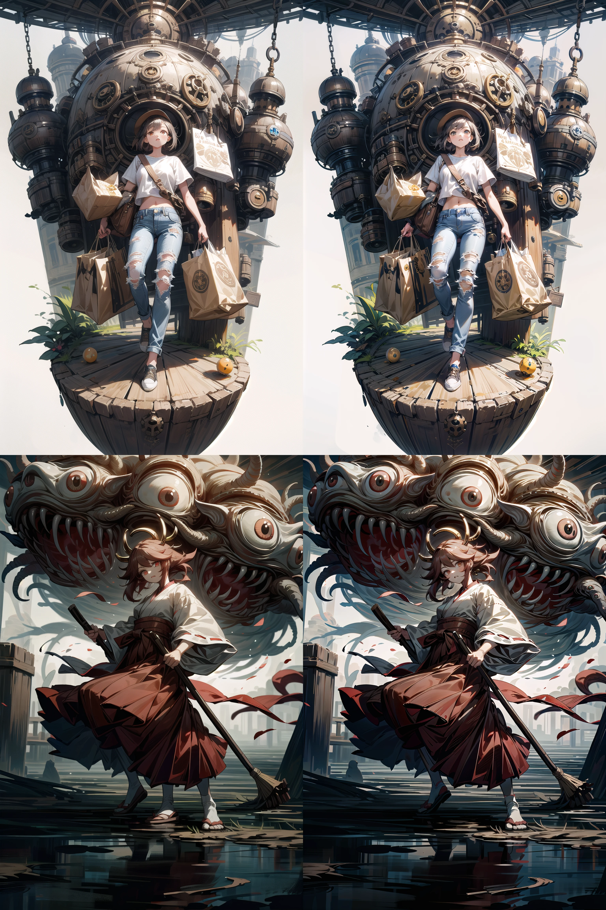

# 更新履歴

## 2023/06/07
- ダウンロードに失敗したファイルをリソースの更新前に削除していましたが、リソースの更新後に変更しました。
	- 起動時にダウンロードに失敗したファイルのエラー表示が軽減されます。
- モデルや LoRA のダウンロードバージョンの取り扱いを、Civitai Helper のバージョンチェック結果を優先する運用に変更しました。
- モデルを 10 種追加しました。
- LoRAを 12 種追加しました。

## 2023/06/05
- チュートリアルに「[高コスパ！簡単ゴージャスアップスケール！](./_/doc/TileUpscale/TileUpscale.md)」と「[アプスケ前の手ガチャ](./_/doc/HandGacha/HandGacha.md)」を追加しました。

## 2023/06/01
- チュートリアルに「[Hires. プロンプトで群衆遊びが簡単に！](https://twitter.com/Zuntan03/status/1664124771196612608)」を追加しました。

## 2023/05/27
- LoHa 以降の LoRA を使うための拡張を、locon から lycoris に変更しました。
	- lycoris をインストールするためにいずれかの `UpdateResource*.bat` を実行してから `_\SdWebUi-Installer\Extension\Lycoris.bat` を実行してください。
		- `UpdateResource*.bat` の実行時に `launch.py: error: unrecognized arguments: --lyco-dir ../Lora` のエラーが表示されますが `Lycoris.bat` の実行で解消されます。
	- locon をアンインストールするために `SdWebUi\stable-diffusion-webui\extensions\a1111-sd-webui-locon\` を削除してください。
	- LoRA, Locon, LoRA-LierLa, LoRA-C3Lier は、これまで通り `<lora:NAME:1>` で利用できます。

## 2023/05/24
- チュートリアルに「[BIMO プリセットで手抜き LoRA 階層適用](./_/doc/BimoLoraBlockWeight/BimoLoraBlockWeight.md)」を追加しました。
- TI を 1 種追加しました。

## 2023/05/21
- チュートリアルに「[モノを消すだけじゃない！Lama Cleaner の簡単で多様な高コスパ修正](./_/doc/LamaCleaner/LamaCleaner.md)」を追加しました。
	- LamaCleaner はキホンのキなので使わなきゃソンです。
-  [4x-UltraSharp.pth](https://upscale.wiki/wiki/Model_Database) および [4x-AnimeSharp.pth](https://upscale.wiki/wiki/Model_Database) を自動でインストールするようにしました。
	- 簡単ローカル環境を導入済みの場合は、`UpdateResourceSfw.bat` または `UpdateResourceNsfw.bat` を実行するとインストールされます。
- モデルを 1 種追加しました。
- TI を 1 種追加しました。
- LoRA を 8 種追加しました。

## 2023/05/16
- LoRA を 14 種追加しました。
- TI を 2 種追加しました。

## 2023/05/15
- **大幅な更新をしました。**  
**簡単ローカル環境をすでにインストール済みの方は [SdWebUi の更新](#sdwebui-の更新) に沿って SdWebUi 本体と拡張機能を更新してください。**
	- UI が英語表記になってしまった場合は「Settings」の「Bilingual Localization」にある「Enable Bilingual Localization」のチェックを外して SdWebUi を再起動してください。
	- Stable Diffusion web UI のバージョンも 1.2.1 まで上がっていますので、`SdWebUi\stable-diffusion-webui\venv\` の削除と再起動が必要になる可能性もあります。
- ボタンをポチポチするだけでステキな絵を生成するポチガチャと、チュートリアル「[簡単ポチガチャでステキな絵を探究する](./_/doc/PochiGacha/PochiGacha.md)」を公開しました。  
	- [Wildcard](https://github.com/adieyal/sd-dynamic-prompts) の txt や [Easy Prompot Selector](https://github.com/blue-pen5805/sdweb-easy-prompt-selector) の yaml のセットアップを自動化しています。
	- LoRA ガチャに対応しています。
	- Sfw(Safe For Work) と Nsfw(Not Safe For Work) に対応しています。

	- 次回のチュートリアル更新で、ガチャの打率向上と後処理について説明するつもりです。

- ディスク容量の大部分を占めるモデルを、個別に選択してダウンロードするようにしました。
	- 標準インストールでのディスク容量が 150GB 程度減ります。
	- `_\SdWebUi-Installer\ModelAll\` 以下のバッチファイルを実行して、個別にモデルをダウンロードします。
	- ディスク容量に数百 GB の余裕がある方は `UpdateResourceAllSfw.bat` や `UpdateResourceAllNsfw.bat` で、これまでと同様にすべてのモデルをダウンロードできます。
- SdWebUiが生成した絵を自動的に大きく表示するツール `GenImageViewer.bat` を追加しました。
- 生成した絵からいらないモノを消せるツール `LamaCleaner.bat` を追加しました。
	- 初回起動時はインストールで数分程度の時間がかかります。
- LoRA を 7 種追加しました。
- 拡張機能を 4 種追加しました。

## 2023/05/06
- モデルを 1 種追加しました。
- LoRA を 3 種追加しました。

## 2023/05/05
- インストーラの起動時に注意事項を確認するようにしました。
- LoRA を 69 種追加しました。
- [Easy Generate Forever](https://github.com/blue-pen5805/sdweb-easy-generate-forever) を追加。
	 - 拡張機能は [SdWebUi の更新](#sdwebui-の更新) で更新できます。

## 2023/05/04
- モデルを 2 種追加しました。
- LoRA を 37 種追加しました。

## 2023/05/03
- インストール方法を更新し、モデルや LoRA などのリソースを Safe For Work と Not Safe For Work に分離して、あとからダウンロードするようにしました。
	- [`Setup_SdWebUi.bat`](https://github.com/Zuntan03/SdWebUiTutorial/raw/main/_/SdWebUi-Installer/Setup_SdWebUi.bat) でインストール後に、Safe For Work の `UpdateResourceSfw.bat` か、Not Safe For Work の `UpdateResourceNsfw.bat` でリソースをダウンロードします。
- モデル 4 種追加しました。
- LoRA を 56 種追加しました。
- TI を 1 種追加しました。
- MEGA からの手動ダウンロード時に、ファイルのリネームを例示するようにしました。

## 2023/05/02
- LoRA を 12 種追加しました。
- 可能な範囲で HuggingFace からダウンロードしたモノのプレビュー表示に対応しました。

## 2023/05/01
- モデルを 2 種追加しました。
- LoRA を 61 種追加しました。
- LoRA の増加に伴いフォルダ構成を変更しました。
- Civitai でアクセス過多を防ぐためのダウンロード後の待ち時間を 10 秒から3 秒に変更しました。

## 2023/04/30
- モデルを 1 種追加しました。
- LoRA を 185 種追加しました。
	- 通常適用で平坦に、**マイナス適用でデティールを追加する** LoRA [`Eff/Flat-Detail`](https://huggingface.co/2vXpSwA7/iroiro-lora) を追加しました。

## 2023/04/29
- モデルを 14 種追加しました。
- LoRA を 65 種追加しました。
- TI を 6 種追加しました。
- LoRA の OnTheDesk U883SchoolSwimsuit を新バージョンに更新しました。
- NSFW LoRA が意図せず表示されることを防ぐため、フォルダ名を「Z-*-Z」に変更しました。

## 2023/04/28
- モデルや LoRA のダウンロードサイズが大きいため、基本構成に追加でモデルや LoRA をダウンロードする説明に整理しなおしました。
- [Civitai](https://civitai.com/) のアクセス制限でファイルのダウンロードに失敗したと思われるファイル（サイズが 10KB 未満）を更新時に自動削除するようにしました。
	- `UpdateResource.bat` を実行すると自動的にダウンロードに失敗したファイルを削除し、再度ダウンロードを試みます。  
	アクセス制限が解除されるように、しばらく待ってから再実行してください。
		- 連続的な LoRA のダウンロードリクエストで規制されないように、10秒の待ち時間を設けました。
	- ダウンロードを途中が途中で止まり、ファイルサイズが 10KB 以上になっている場合は、手動でダウンロードに失敗したファイルを削除してください。
- LoRA を 127 種追加しました。
- ControlNet 1.1 の Tile モデルの更新に対応しました。

## 2023/04/26
- [SdWebUi のインストール](./_/doc/SdWebUiInstall/SdWebUiInstall.md)に「[MEGA](https://mega.io/ja/)」から`4x-UltraSharp.bat` や `4x-AnimeSharp.bat` などを簡単に手動ダウンロードする手順を追記しました。

## 2023/04/25
- 「[Civitai からのモデルや LoRA のダウンロード](./_/doc/DownloadFromCivitai/DownloadFromCivitai.md)」に「ダウンロードしたモデルや LoRA をつかう」を追記しました。

## 2023/04/24
- チュートリアルに「[Civitai からのモデルや LoRA のダウンロード](./_/doc/DownloadFromCivitai/DownloadFromCivitai.md)」を追加しました。

## 2023/04/23
- [公開を告知](https://twitter.com/Zuntan03/status/1650006478986805248)しました。
- Model 1種、TI 1種、Lora 2種を追加しました。  
[リソースの更新](#リソースの更新) で追加ダウンロードできます。
- 情報追記
	- [`Setup_SdWebUi.bat`](https://github.com/Zuntan03/SdWebUiTutorial/raw/main/_/SdWebUi-Installer/Setup_SdWebUi.bat) の通常構成では [VAE 一覧](https://github.com/Zuntan03/SdWebUiTutorial/tree/main/_/SdWebUi-Installer/Vae)・[TI 一覧](https://github.com/Zuntan03/SdWebUiTutorial/tree/main/_/SdWebUi-Installer/Embedding)・[拡張一覧](https://github.com/Zuntan03/SdWebUiTutorial/tree/main/_/SdWebUi-Installer/Extension)・[ControlNetModel 一覧](https://github.com/Zuntan03/SdWebUiTutorial/tree/main/_/SdWebUi-Installer/ControlNetModel) をダウンロードします。
	- [`SetupAll_SdWebUi.bat`](https://github.com/Zuntan03/SdWebUiTutorial/raw/main/_/SdWebUi-Installer/SetupAll_SdWebUi.bat) は通常構成に加え [Model 一覧（巨大）](https://github.com/Zuntan03/SdWebUiTutorial/tree/main/_/SdWebUi-Installer/Model)・[LoRA 一覧](https://github.com/Zuntan03/SdWebUiTutorial/tree/main/_/SdWebUi-Installer/Lora) をダウンロードします。
