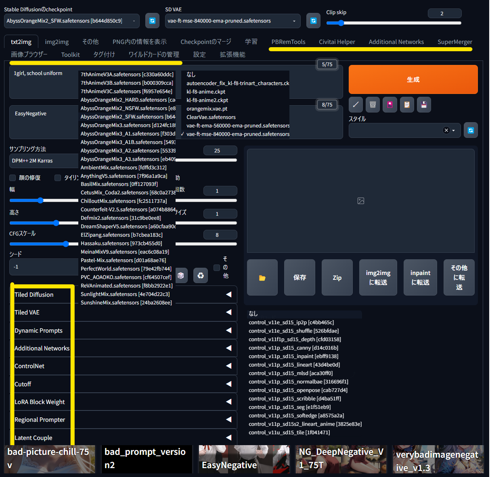
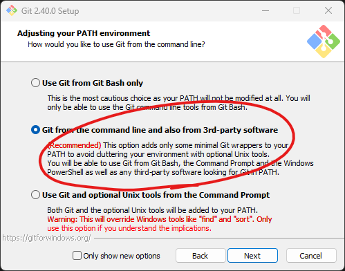
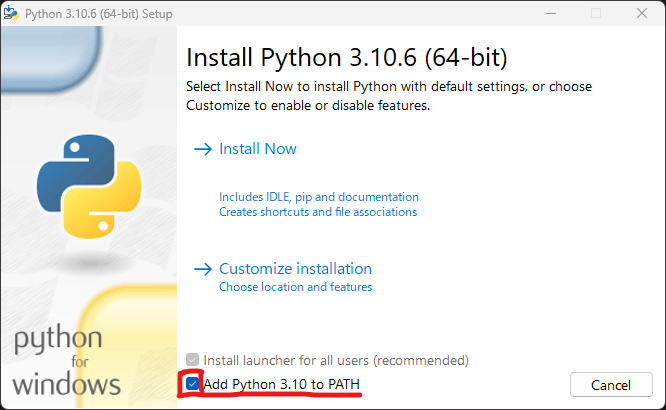
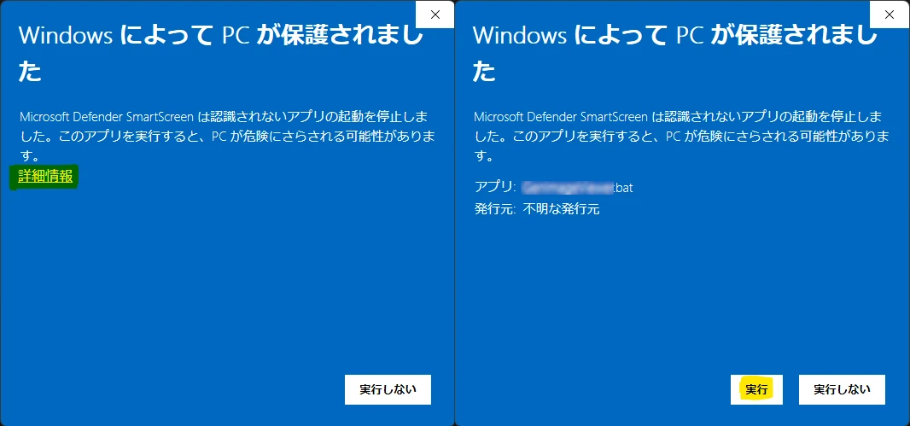
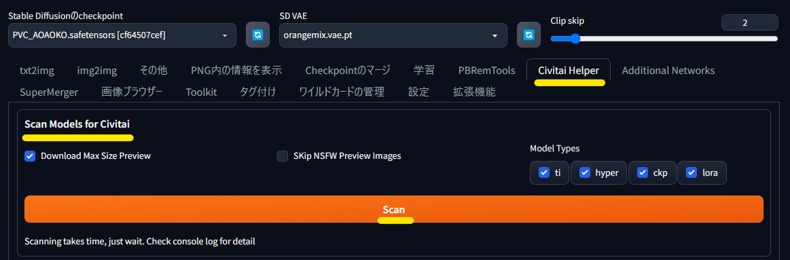
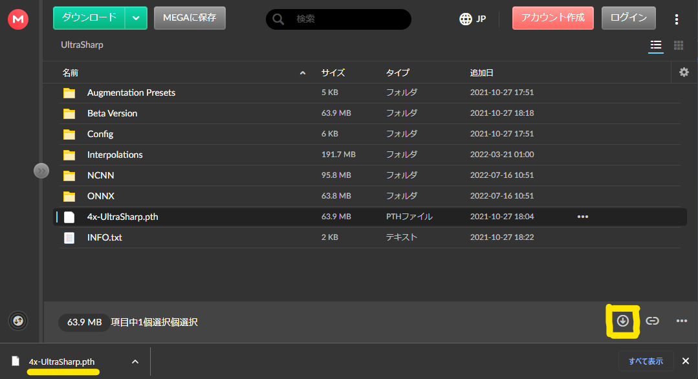

# Stable Diffusion web UI のチュートリアル

画像生成 AI ツールの [Stable Diffusion web UI](https://github.com/AUTOMATIC1111/stable-diffusion-webui)(SdWebUi) を簡単にローカルで使えるようにする環境とチュートリアルです。

bat の実行だけで[SdWebUi](https://github.com/AUTOMATIC1111/stable-diffusion-webui)・[拡張機能](https://github.com/Zuntan03/SdWebUiTutorial/tree/main/_/SdWebUi-Installer/Extension)・[モデル](https://github.com/Zuntan03/SdWebUiTutorial/tree/main/_/SdWebUi-Installer/Model)・[VAE](https://github.com/Zuntan03/SdWebUiTutorial/tree/main/_/SdWebUi-Installer/Vae)・[TI](https://github.com/Zuntan03/SdWebUiTutorial/tree/main/_/SdWebUi-Installer/Embedding)・[LoRA](https://github.com/Zuntan03/SdWebUiTutorial/tree/main/_/SdWebUi-Installer/Lora) などの AI 画像生成の環境が整います。  

# 直近の更新履歴

## 2023/05/05
- インストーラの起動時に注意事項を確認するようにしました。

## 2023/05/04
- モデルを 2 種追加しました。
- LoRA を 37 種追加しました。

## 2023/05/03
- インストール方法を更新し、モデルや LoRA などのリソースを Safe For Work と Not Safe For Work に分離して、あとからダウンロードするようにしました。
	- [`Setup_SdWebUi.bat`](https://github.com/Zuntan03/SdWebUiTutorial/raw/main/_/SdWebUi-Installer/Setup_SdWebUi.bat) でインストール後に、Safe For Work の `UpdateResourceSfw.bat` か、Not Safe For Work の `UpdateResourceNsfw.bat` でリソースをダウンロードします。
- モデル 4 種追加しました。
- LoRA を 56 種追加しました。
- TI を 1 種追加しました。
- MEGA からの手動ダウンロード時に、ファイルのリネームを例示するようにしました。

## 2023/05/02
- LoRA を 12 種追加しました。
- 可能な範囲で HuggingFace からダウンロードしたモノのプレビュー表示に対応しました。

## 2023/05/01
- モデルを 2 種追加しました。
- LoRA を 61 種追加しました。
- LoRA の増加に伴いフォルダ構成を変更しました。
- Civitai でアクセス過多を防ぐためのダウンロード後の待ち時間を 10 秒から3 秒に変更しました。

[過去の更新履歴](./ChangeLog.md)

# 目次

日付が古いものは、内容が古くなっている可能性があります。  
日付の記載ないものは、最新の状況にあわせてメンテナンスしていますので、問題があれば [Twitter](https://twitter.com/Zuntan03) や [Issues](https://github.com/Zuntan03/SdWebUiTutorial/issues) でお知らせください。

- [インストール方法（簡易版）](#インストール方法)
- [更新方法](#更新方法)

## チュートリアル初級

- [Stable Diffusion web UI のインストール（詳細版）](./_/doc/SdWebUiInstall/SdWebUiInstall.md)
- [最初の 1girl 画像生成](/_/doc/First1Girl/First1Girl.md)
- [Civitai からのモデルや LoRA のダウンロード](./_/doc/DownloadFromCivitai/DownloadFromCivitai.md)

## チュートリアル中級

- [2023/02/26] [ControlNet の openpose と hed で、ポーズを指定しつつも詳細な背景と正常な手を無料で描画する手法](https://twitter.com/Zuntan03/status/1629739504801320960)
- [2023/02/25] [Multi ControlNet の depth と hed で画像から形状のみを取り出す](https://twitter.com/Zuntan03/status/1629362974547906566)
- [2023/02/23] [LatentCoupleHelperのつかいかた](https://twitter.com/Zuntan03/status/1628631380459663360)

## チュートリアル上級

- [2023/03/27] [AI画像生成のキャラクターフレームワークを作ってみた](https://twitter.com/Zuntan03/status/1640240599323541504)
- [2023/04/11] [SdWebUI の LoRA Block Weight 拡張で、LoRA の適用具合を調整するチュートリアル＆お助けツール](https://twitter.com/Zuntan03/status/1645603234801926144)

## レビュー

- [2023/02/26] [SdWebUI の ControlNet で利用する観点での DesignDoll の評価](https://twitter.com/Zuntan03/status/1629501963913285633)

# インストール方法

簡易な説明でも理解できる人向けのインストール方法の説明です。  
**より丁寧なインストール方法の説明は「[Stable Diffusion web UI のインストール](./_/doc/SdWebUiInstall/SdWebUiInstall.md)」にあります。**

最近の NVIDIA 製ビデオカードを搭載した Windows 10（Windows Update済み）以降の PC で、300GB 程度のディスク容量が必要です。  
ファイルのダウンロード時に配布元の URL をコンソールに表示します。URL を Ctrl + Click で開き、利用規約などを遵守してご利用ください。  
成人でない方が成人向けのコンテンツを利用することは禁止です。

1. [Git for Windows](https://gitforwindows.org/) と [Python 3.10.6](https://www.python.org/ftp/python/3.10.6/python-3.10.6-amd64.exe) を、**パスを通して**インストールします。  

2. インストール先のフォルダを英数字のみの浅いパスに用意します（`C:\SdWebUiTutorial` や `C:\SD` など）。
3. [`Setup_SdWebUi.bat`](https://github.com/Zuntan03/SdWebUiTutorial/raw/main/_/SdWebUi-Installer/Setup_SdWebUi.bat) を **右クリックから「名前をつけてリンク先を保存…」** でインストール先にダウンロードして、ダブルクリックで実行します。  
	- **「WindowsによってPCが保護されました」と表示されたら、「詳細表示」から「実行」します。**  

4. 注意事項の確認の後にダウンロードとインストールが完了すると、ブラウザに SdWebUi が表示されます。  
**以降は「`SdWebUi.bat`」をダブルクリックすれば SdWebUi を実行できます。**
5. [リソースの更新](#リソースの更新) でモデルや LoRA などをダウンロードするか、[最初の 1girl 画像生成](./_/doc/First1Girl/First1Girl.md) で簡単に画像を生成できることを確認します。  

# 更新方法

## リソースの更新

モデルや LoRA などのリソースを更新します。  
トラブルが発生する可能性は低いので、気楽に更新してください。

1. [Civitai](https://civitai.com/) が落ちていないことを確認して、Safe For Work の `UpdateResourceSfw.bat` か、Not Safe For Work の `UpdateResourceNsfw.bat` を実行します。
	- 正しくダウンロードできていなさそうなモデルや LoRA がありましたら、削除して bat を再実行してください。
2. 更新後に SdWebUi が立ち上がったら、上部タブから「Civitai Helper」を選択して「Scan Models for Civitai」で「Scan」します。  

	- Scan ボタンの下に「`Connect to Civitai API service failed. Wait a while and try again, check console log for detail`」といったエラーメッセージが表示されたら、しばらく待ってから再実行してください。
3. スキャンが終わったら、上部タブの「txt2img」に戻って花札マークの「extra networks」から「リフレッシュ」と「Refresh Civitai Helper's additional buttons」を押します。  

## 手動でダウンロードするリソース

画像をキレイに拡大するアップスケーラなどの自動でダウンロードできない追加のリソースを、簡単に手動でダウンロードできます。  

1. `_\SdWebUi-ManualDownload` 以下の bat ファイルを実行すると、ダウンロードページとインストール先フォルダを開きます。
	- コンソールに LoRA などのファイル名や配置場所を表示する場合があります。
2. [MEGA](https://mega.io/ja) からのダウンロードは左上の Zip ダウンロードではなく右下の下矢印ボタンでダウンロードして、ダウンロードしたファイルをインストール先へ移動してください。

## SdWebUi の更新

SdWebUi や拡張機能の更新はトラブルが起きがちですので、時間に余裕のあるタイミングで実施してください。  
トラブル対応のためにバックアップをとるため、「`SdWebUi\stable-diffusion-webui\`」相当(10GB 前後)のディスク容量を消費します。

1. SdWebUi を終了した状態で、`_\SdWebUi-Update.bat` で更新します。
2. 更新後に問題が発生した場合は SdWebUi を終了し、`SdWebUi\stable-diffusion-webui\venv\` を削除してから `SdWebUi.bat` で再起動します。
2. 更新後の問題が解決できない場合は `SdWebUi\stable-diffusion-webui\` を削除して、`SdWebUi\stable-diffusion-webui_backup\` を `SdWebUi\stable-diffusion-webui\` にリネームして巻き戻します。
3. 安定動作を確認できたのであれば、`SdWebUi\stable-diffusion-webui_backup\` を削除しても問題ありません。

# ライセンス

[MIT License](./LICENSE.txt)です。

This software is released under the MIT License, see [LICENSE.txt](./LICENSE.txt).
