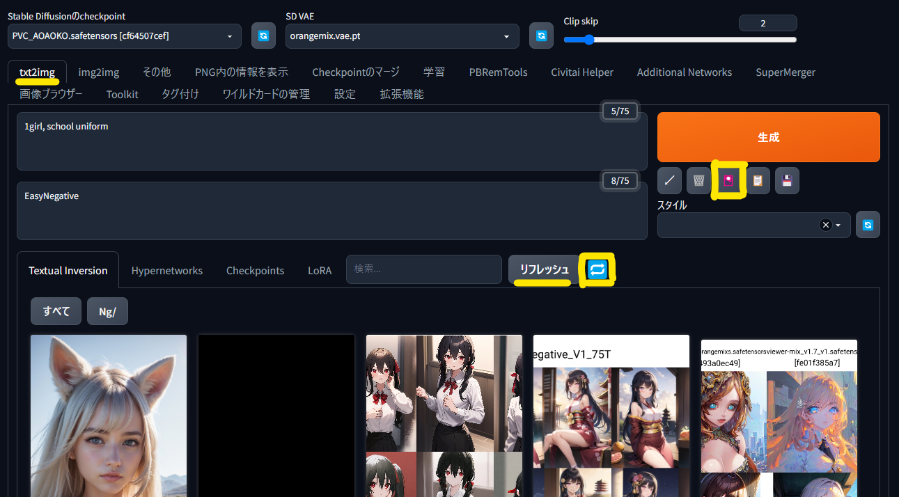

# Stable Diffusion web UI のチュートリアル

画像生成 AI ツールの [Stable Diffusion web UI](https://github.com/AUTOMATIC1111/stable-diffusion-webui)(SdWebUi) を簡単にローカルで使えるようにする環境とチュートリアルです。

bat の実行だけで[SdWebUi](https://github.com/AUTOMATIC1111/stable-diffusion-webui)・[拡張機能](https://github.com/Zuntan03/SdWebUiTutorial/tree/main/_/SdWebUi-Installer/Extension)・[モデル](https://github.com/Zuntan03/SdWebUiTutorial/tree/main/_/SdWebUi-Installer/Model)・[VAE](https://github.com/Zuntan03/SdWebUiTutorial/tree/main/_/SdWebUi-Installer/Vae)・[TI](https://github.com/Zuntan03/SdWebUiTutorial/tree/main/_/SdWebUi-Installer/Embedding)・[LoRA](https://github.com/Zuntan03/SdWebUiTutorial/tree/main/_/SdWebUi-Installer/Lora) などの AI 画像生成の環境が整います。  
追加で簡単に[アップスケーラー](https://github.com/Zuntan03/SdWebUiTutorial/tree/main/_/SdWebUi-ManualDownload/Upscaler)もダウンロードできます。

# 直近の更新履歴
- 2023/04/28
	- モデルや LoRA のダウンロードサイズが大きいため、基本構成に追加でモデルや LoRA をダウンロードする説明に整理しなおしました。
	- LoRA を 9 種追加しました。
- 2023/04/26
	- [SdWebUi のインストール](./_/doc/SdWebUiInstall/SdWebUiInstall.md)に「[MEGA](https://mega.io/ja/)」から`4x-UltraSharp.bat` や `4x-AnimeSharp.bat` などを簡単に手動ダウンロードする手順を追記しました。
- [より古い更新履歴](./ChangeLog.md)

# 目次

日付が古いものは、内容が古くなっている可能性があります。  
日付の記載ないものは、最新の状況にあわせてメンテナンスしていますので、問題があれば [Twitter](https://twitter.com/Zuntan03) や [Issues](https://github.com/Zuntan03/SdWebUiTutorial/issues) でお知らせください。

- [インストール方法（簡易版）](#インストール方法)
- [更新方法](#更新方法)

## チュートリアル初級

- [Stable Diffusion web UI のインストール（詳細版）](./_/doc/SdWebUiInstall/SdWebUiInstall.md)
- [最初の 1girl 画像生成](/_/doc/First1Girl/First1Girl.md)
- [Civitai からのモデルや LoRA のダウンロード](./_/doc/DownloadFromCivitai/DownloadFromCivitai.md)

## チュートリアル中級

- [2023/02/26] [ControlNet の openpose と hed で、ポーズを指定しつつも詳細な背景と正常な手を無料で描画する手法](https://twitter.com/Zuntan03/status/1629739504801320960)
- [2023/02/25] [Multi ControlNet の depth と hed で画像から形状のみを取り出す](https://twitter.com/Zuntan03/status/1629362974547906566)
- [2023/02/23] [LatentCoupleHelperのつかいかた](https://twitter.com/Zuntan03/status/1628631380459663360)

## チュートリアル上級

- [2023/03/27] [AI画像生成のキャラクターフレームワークを作ってみた](https://twitter.com/Zuntan03/status/1640240599323541504)
- [2023/04/11] [SdWebUI の LoRA Block Weight 拡張で、LoRA の適用具合を調整するチュートリアル＆お助けツール](https://twitter.com/Zuntan03/status/1645603234801926144)

## レビュー

- [2023/02/26] [SdWebUI の ControlNet で利用する観点での DesignDoll の評価](https://twitter.com/Zuntan03/status/1629501963913285633)

# インストール方法

簡易な説明でも理解できる人向けのインストール方法の説明です。  
**より丁寧なインストール方法の説明は「[Stable Diffusion web UI のインストール](./_/doc/SdWebUiInstall/SdWebUiInstall.md)」にあります。**

最近の NVIDIA 製ビデオカードを搭載した Windows 10（Windows Update済み）以降の PC で、150GB 程度のディスク容量が必要です。  
成人向けのモデルや Lora を含みますので、成人でない方の利用は禁止です。  
ファイルのダウンロード時に配布元の URL をコンソールに表示します。URL を Ctrl + Click で開き、利用規約などを遵守してご利用ください。

1. [Git for Windows](https://gitforwindows.org/) と [Python 3.10.6](https://www.python.org/ftp/python/3.10.6/python-3.10.6-amd64.exe) を、**パスを通して**インストールします。  

2. インストール先のフォルダを英数字のみの浅いパスに用意します（`C:\SdWebUiTutorial` や `C:\SD` など）。
3. [`Setup_SdWebUi.bat`](https://github.com/Zuntan03/SdWebUiTutorial/raw/main/_/SdWebUi-Installer/Setup_SdWebUi.bat)（基本構成）または [`SetupAll_SdWebUi.bat`](https://github.com/Zuntan03/SdWebUiTutorial/raw/main/_/SdWebUi-Installer/SetupAll_SdWebUi.bat)（全部入り、100GB 超え）を **右クリックから「名前をつけてリンク先を保存…」** でインストール先にダウンロードして、ダブルクリックで実行します。  
	- **「WindowsによってPCが保護されました」と表示されたら、「詳細表示」から「実行」します。**  

	- **[`Setup_SdWebUi.bat`](https://github.com/Zuntan03/SdWebUiTutorial/raw/main/_/SdWebUi-Installer/Setup_SdWebUi.bat)（基本構成）でインストールした場合は、寝る前などの時間の余裕がある時に「[リソースの更新](#リソースの更新)」に沿って、大量のモデルや LoRA をダウンロードしてください。**
		- 基本構成では [VAE 一覧](https://github.com/Zuntan03/SdWebUiTutorial/tree/main/_/SdWebUi-Installer/Vae)・[TI 一覧](https://github.com/Zuntan03/SdWebUiTutorial/tree/main/_/SdWebUi-Installer/Embedding)・[拡張一覧](https://github.com/Zuntan03/SdWebUiTutorial/tree/main/_/SdWebUi-Installer/Extension)・[ControlNetModel 一覧](https://github.com/Zuntan03/SdWebUiTutorial/tree/main/_/SdWebUi-Installer/ControlNetModel)・[AbyssOrangeMix2Sfw](https://huggingface.co/WarriorMama777/OrangeMixs/),・[BasilMix](https://huggingface.co/nuigurumi/basil_mix) をダウンロードします。
		- 基本構成でセットアップしてから、`_\SdWebUi-Installer\` の `Model\` や `Lora\` にある bat ファイルでモデルや LoRA を個別にダウンロードすることもできます。
	- [`SetupAll_SdWebUi.bat`](https://github.com/Zuntan03/SdWebUiTutorial/raw/main/_/SdWebUi-Installer/SetupAll_SdWebUi.bat)（全部入り）は 100GB を超えるファイルをダウンロードしますので、寝る前などにインストールする場合にご利用ください。
		- モデルや LoRA は主に [Civitai](https://civitai.com/) からダウンロードしますので、[Civitai](https://civitai.com/) が落ちていない時に実行してください。
		- 基本構成に加え [Model 一覧（巨大）](https://github.com/Zuntan03/SdWebUiTutorial/tree/main/_/SdWebUi-Installer/Model)・[LoRA 一覧](https://github.com/Zuntan03/SdWebUiTutorial/tree/main/_/SdWebUi-Installer/Lora) をダウンロードします。

4. インストールが終わるとブラウザに SdWebUi が表示されますので、上部タブから「Civitai Helper」を選択して、「Scan Models for Civitai」で「Scan」します。  

5. スキャンが終わったら、上部タブの「txt2img」に戻って花札マークの「extra networks」から「リフレッシュ」と「Refresh Civitai Helper's additional buttons」をします。  

6. インストールは完了です。  
**以降は「`SdWebUi.bat`」をダブルクリックすれば SdWebUi を実行できます。**
7. 画像を拡大するアップスケーラなどの自動でダウンロードできない追加のリソースを、簡単に手動でダウンロードできます。  
`_\SdWebUi-ManualDownload` 以下の bat ファイルを実行すると、ダウンロードページとインストール先フォルダを開きます。  
[MEGA](https://mega.io/ja) からのダウンロードは左上の Zip ダウンロードではなく右下の下矢印ボタンでダウンロードして、ダウンロードしたファイルをインストール先へ移動してください。

8. [最初の 1girl 画像生成](./_/doc/First1Girl/First1Girl.md) で簡単に画像を生成できることを確認します。  

# 更新方法

## リソースの更新

追加されたモデルや LoRA などを、すべてダウンロードします。  
トラブルが発生する可能性は低いので、気楽に更新してください。

1. [Civitai](https://civitai.com/) が落ちていないことを確認して、「`UpdateResource.bat`」 を実行します。
2. 更新後に SdWebUi が立ち上がったら、上部タブから「Civitai Helper」を選択して「Scan Models for Civitai」で「Scan」します。  

3. スキャンが終わったら、上部タブの「txt2img」に戻って花札マークの「extra networks」から「リフレッシュ」と「Refresh Civitai Helper's additional buttons」をします。  

## すべての更新

SdWebUi の更新はトラブルが起きがちですので、時間的に余裕のあるタイミングで実施してください。  
トラブル対応のためにバックアップをとるため、「`SdWebUi\stable-diffusion-webui\`」相当(10GB 前後)のディスク容量を消費します。

1. SdWebUi を終了した状態で、インストール先の「`_\SdWebUi-UpdateAll.bat`」で更新します。
	- モデルや LoRA を個別に手動ダウンロードしている方は「`_\SdWebUi-Update.bat`」をご利用ください。
2. 更新後に問題が発生した場合は、「`SdWebUi\stable-diffusion-webui\`」をリネームまたは削除し、「`SdWebUi\stable-diffusion-webui_backup\`」を「`SdWebUi\stable-diffusion-webui\`」にリネームして巻き戻します。
3. 安定動作を確認できたのであれば、「`SdWebUi\stable-diffusion-webui_backup\`」を削除しても問題ありません。

# ライセンス

[MIT License](./LICENSE.txt)です。

This software is released under the MIT License, see [LICENSE.txt](./LICENSE.txt).
