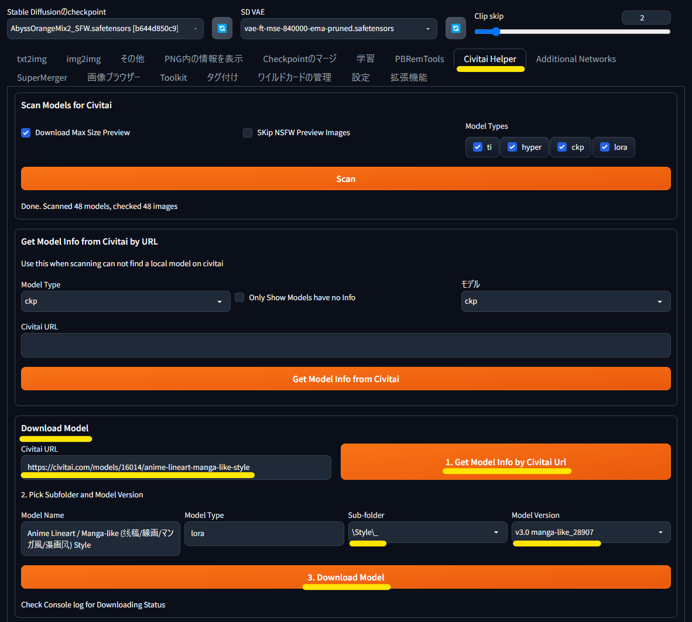
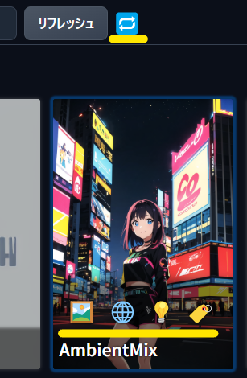
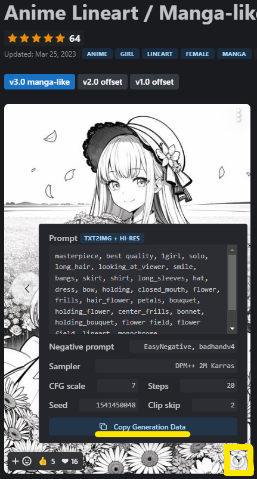
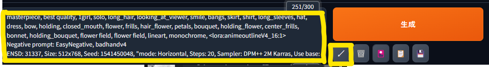
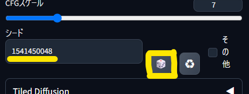

# Civitai からのモデルや LoRA のダウンロード

[Civitai](https://civitai.com/) は AI 画像生成の画風を制御するモデルと、特殊効果を加える LoRA などをダウンロードできるサイトです。  
モデルや LoRA などが多く掲載されており、「[Civitai Helper 拡張](https://github.com/butaixianran/Stable-Diffusion-Webui-Civitai-Helper)」でプレビュー画像の設定や LoRA のキーワード入力を自動化できることが特徴です。

- [アカウントの登録](#アカウントの登録)
- [モデルや LoRA のダウンロード](#モデルや-lora-のダウンロード)
- [ダウンロードしたモデルや LoRA をつかう](#ダウンロードしたモデルや-lora-をつかう)

# アカウントの登録

 Civitai のすべてのコンテンツを閲覧するにはアカウントの作成が必要です。

右上のメニューから「Account settings」を選び、「Content Moderation」をすべてを有効にすると、すべてのコンテンツを閲覧できます。

# モデルや LoRA のダウンロード

モデルや LoRA をダウンロードするには **Civitaiの「Download」ボタンではなく**、SdWebUi の「[Civitai Helper 拡張](https://github.com/butaixianran/Stable-Diffusion-Webui-Civitai-Helper)」を使います。

Web ブラウザのダウンロードフォルダからのコピーや、メタ情報の取得が不要になります。

1. [Civitai](https://civitai.com/) でダウンロードしたいモデルや LoRA を探します。
2. ダウンロードしたいものが見つかったら、「`SdWebUi.bat`」を実行して上部の「Civitai Helper」を選びます。  
「Download Model」の「Civitai URL」に Web ブラウザから URL をコピペして「1. Get Model Info by Civitai Url」します。
3. モデルのメタ情報がダウンロードされたら「Sub-folder」で保存場所を「Model Version」でバージョンを指定して、「3. Download Model」でダウンロードします。
	- 保存場所はモデルは `SdWebUi\Model\` 以下に、LoRAは `SdWebUi\Lora\` 以下になります。
		- サブフォルダはお好みで作成してください。
	- バージョンは通常は最新版を指定します。

# ダウンロードしたモデルや LoRA をつかう

Civitai からダウンロードしたモデルや LoRA は一覧上部の更新ボタンを押してカードの名前にマウスカーソルをあわせると、4 つの追加のボタンが使えるようになります。

1. プレビュー画像を差し替えるボタンです。
2. Civitai の配布ページをブラウザで開くボタンです。
	- モデルや LoRA には特別な設定を必要とするものがありますので、うまく使えない場合に確認します。
3. LoRA の効果を高めるために用意されたトリガーワードを、プロンプトに自動入力します。
	- カード自体をクリックして、LoRA の呼び出しワードも追加する必要があります。
4. プレビュー画像のプロンプトを自動入力します。
	- プロンプト以外のパラメータも設定したい場合は「2.」で Civitai のページを表示して、画像右下の「丸i」マークから「Copy Generation Data」して、プロンプトにペーストした後に「生成」ボタン下の矢印ボタンで適用します。  
  

		- 絵の生成結果にはこの方法で設定できるパラメータ以外にも様々な要素が影響しますので、完全に同じ絵は生成されません。
		- パラメータを適用するとシードがランダムを意味する「-1」から別の値に設定されて、ずっと同じ絵が出力されるようになります。  
		忘れずにサイコロボタンでシードを「-1」に戻します。  

