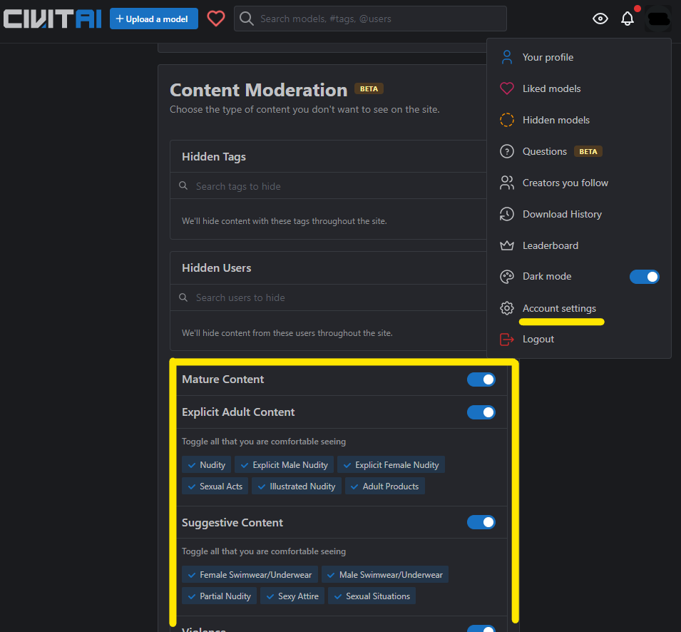

# Civitai からのモデルや LoRA のダウンロード

[Civitai](https://civitai.com/) は AI 画像生成の画風を制御するモデルと、特殊効果を加える LoRA などをダウンロードできるサイトです。  
モデルや LoRA などが多く掲載されており、「[Civitai Helper 拡張](https://github.com/butaixianran/Stable-Diffusion-Webui-Civitai-Helper)」でプレビュー画像の設定や LoRA のキーワード入力を自動化できることが特徴です。

# アカウントの登録

 Civitai のすべてのコンテンツを閲覧するにはアカウントの作成が必要です。

右上のメニューから「Account settings」を選び、「Content Moderation」をすべてを有効にすると、すべてのコンテンツを閲覧できます。

# モデルや LoRA のダウンロード

モデルや LoRA をダウンロードするには **Civitaiの「Download」ボタンではなく**、SdWebUi の「[Civitai Helper 拡張](https://github.com/butaixianran/Stable-Diffusion-Webui-Civitai-Helper)」を使います。

Web ブラウザのダウンロードフォルダからのコピーや、メタ情報の取得が不要になります。

1. [Civitai](https://civitai.com/) でダウンロードしたいモデルや LoRA を探します。
2. ダウンロードしたいものが見つかったら、「`SdWebUi.bat`」を実行して上部の「Civitai Helper」を選びます。  
「Download Model」の「Civitai URL」に Web ブラウザから URL をコピペして「1. Get Model Info by Civitai Url」します。
3. モデルのメタ情報がダウンロードされたら「Sub-folder」で保存場所を「Model Version」でバージョンを指定して、「3. Download Model」でダウンロードします。
	- 保存場所はモデルは `SdWebUi\Model\` 以下に、LoRAは `SdWebUi\Lora\` 以下になります。
		- サブフォルダはお好みで作成してください。
	- バージョンは通常は最新版を指定します。
