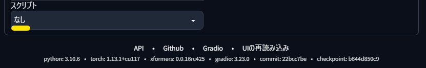
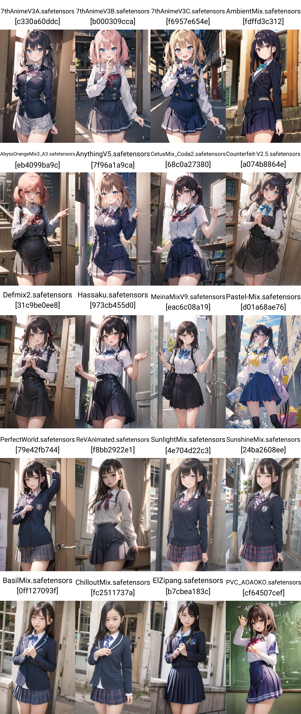

# 最初の 1girl 画像生成

画像生成 AI ツールの [Stable Diffusion web UI](https://github.com/AUTOMATIC1111/stable-diffusion-webui)(SdWebUi) で画像を生成するチュートリアルです。

先に「[Stable Diffusion web UI のインストール](../SdWebUiInstall/SdWebUiInstall.md)」を済ませておく必要があります。

# 画像生成の手順

学生服を着た少女の絵を「`1girl, school uniform`」と指示して、AI で生成します。

1. SdWebUi が立ち上がっていない場合は、`SdWebUi.bat` をダブルクリックで実行します。
2. しばらく待つと、Web ブラウザに SdWebUi が表示されますので、次の 4 点を設定して「生成」します。

	- 「Stable Diffusionのcheckpoint」を「AbyssOrangeMix2_SFW」
		- 「checkpoint」は「モデル」とも呼ばれ、主に生成する画像の画風を決めます。
	- 「SD VAE」を「vae-ft-mse-840000-ema.pruned」
		- VAE は絵の彩度や細部に影響します。
		- この 840000 は実写系をメインとしつつも、イラスト系もこなせています。 
	- 「プロンプト」に「`1girl, school uniform`」
		- プロンプトで AI にどんな絵を描きたいかを指示します。
	- 「高解像度補助」をチェックする
		- 「幅」「高さ」で指定した画像のサイズをさらに 1.5 倍して、より詳細に書き込みます。
3. 生成が終わると png 形式のちょっとイマイチな画像が「`SdImage\日付\`」に保存されます。
	- 画面右側のプレビュー画像をクリックすると、大きく表示できます。
4. よりキレイな画像を生成するために、「ネガティブプロンプト」に「Textual Inversion」の「EasyNegative」を指定して「生成」します。

	- 「ネガティブプロンプト」も「Textual Inversion」も、最初は「定型文でキレイになるらしい」から慣れましょう。検索すれば大量の情報はありますが、情報に溺れないように気をつけてください。
	- 花札マークの「extra networks」で「Textual Inversion」や「Checkpoints」や「LoRA」をプレビュー付きで選択できます。
		- 「Textual Inversion」はネガティブプロンプトの設定によく使われます。
		- 「LoRA」は学習させた様々な効果を画像生成に適用できます。
	- 「ネガティブプロンプト」をクリックしてから「Textual Inversion」の「EasyNegative」をクリックすると、「ネガティブプロンプト」に「`EasyNegative`」と自動入力されます。
		- キーボード入力での打ち間違いを防ぐために、このような自動入力を使ったほうがよいでしょう。

# いろいろな画風の 1girl

よりキレイな `1girl` 画像を生成できましたでしょうか。  
次はモデル(checkpoint)を切り替えながら、様々な画風で `1girl` 画像を生成します。

SdWebUi には画像生成の様々なパラメータを一括で楽に指定して画像を生成する「X/Y/Z plot」機能があります。  
これを利用して様々な画風の `1girl` を一気に生成して、好みの画風を見つけましょう。

1. 画面左下の「スクリプト」の「なし」をクリックして、「X/Y/Z plot」を選びます。  

2. 「X軸の種類」を「Checkpoint name」にして、右側のボタンを押すと「X軸の値」にすべてのモデル名が入力されます。  

	- スペースの都合上で表示を削っていますが、実際は多数のモデルで「X軸の値」が縦長になります。
3. 「生成」すると同じ条件でモデルだけを切り替えた絵が次々と生成されます。
	- 最後にすべての絵をまとめたグリッド画像が生成され、「`SdGrid\日付\`」以下に保存されます。

以下のようにアニメ、イラスト、セミリアル、リアル、フィギュアと様々な画風で画像を生成できました（実際は横一列で生成されます）。  
お好みの画風で引き続き画像の生成をお楽しみください。

「X/Y/Z plot」はモデル名以外にも様々なパラメータの変化を確認できますので、とても重宝する機能です。

