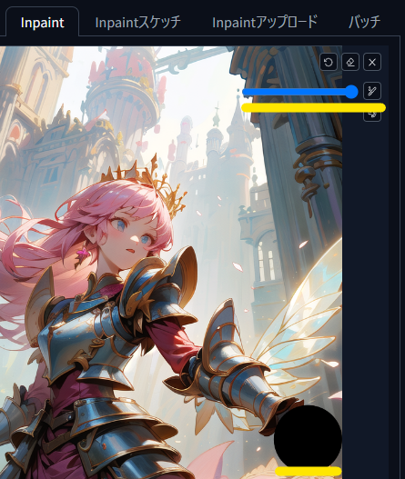
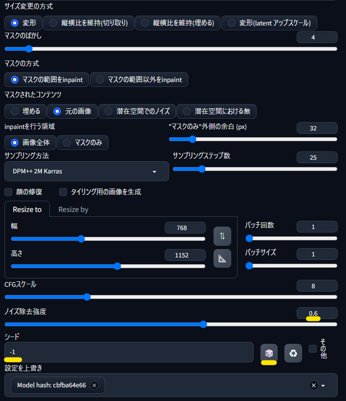

# アプスケ前の手ガチャ

<!-- TODO: 概要紹介は[こちら]()。-->

手の修正で「inpaint のノイズ除去強度が低くて手の形が変わらない、高めると手でないﾓﾉが生成される」といった課題を避ける手ガチャです。

[Tiled Diffusion & VAE](https://github.com/pkuliyi2015/multidiffusion-upscaler-for-automatic1111) と [ControlNet Tile](https://github.com/Mikubill/sd-webui-controlnet) でアップスケールする、「Tile アプスケ」と併用する前提の手法です。  
Tile アプスケでは元絵がそれなりに維持されつつ、ディティールもそれなりに追加されます。  
元絵が維持されることで手の修正が破壊されずに残り、ディティールが追加されることで修正した手がより馴染みます。

# 手ガチャの手順

`txt2img` で生成した画像の手を、`img2img` の `Inpaint` で修正します。  
標準的な [Stable Diffusion web UI](https://github.com/AUTOMATIC1111/stable-diffusion-webui) の環境で動作します。

この手順紹介では、以下の 画像の手を修正します。  

`512px x 768px` を高解像度補助で 1.5倍にした、`768px x 1152px` の画像です。  
手が肌の色でないため、手でないモノに化けがちな修正しにくい画像です。

## LamaCleaner で手の形を整える

`Inpaint` では元絵を書き換えて新たな絵を生成するため、元絵が望む絵に近いほど手ガチャの打率が上がります。  

今回は余計な指を LamaCleaner で消してしまいます。  
修正した絵を保存する際に、元絵を上書きしないように注意してください。

LamaCleaner については「[モノを消すだけじゃない！Lama Cleaner の簡単で多様な高コスパ修正](https://github.com/Zuntan03/SdWebUiTutorial/blob/main/_/doc/LamaCleaner/LamaCleaner.md)」を参照してください。

## inpaint で手をガチャる

`PNG内の情報を表示` で **元絵** をドラッグ＆ドロップで読み込み、`inpaintに転送` します。

`Inpaint` タブに元絵が転送されたら、LamaCleaner で修正した絵をドラッグ＆ドロップで差し替えます。  
また、`SD VAE` に元絵を生成する際に使った VAE を設定します。  
プロンプトやネガティブプロンプトは元絵のままです。

`Inpaint` のペンの太さを手の可動範囲ぐらいに調整して、マスクを設定します。

`Inpaint` のパラメータでは、サイコロボタンを押して `シード` を `-1` にします。  
`ノイズ除去強度` は `0.6` にしていますが、元絵の手の形をより残したい場合は `0.4` あたりに下げます。  
**`inpaintを行う領域` は `画像全体` で、`マスクのみ` には変更しません。**  
`画像全体` にすることで、手が生成されるガチャ打率を高めています。

元絵の生成時に `ControlNet` や `ADetailer` といった他の機能を使っていた場合は、無効にしてください。

`生成` すると色々な形状の手が生成されます。

元絵の生成条件などにより手が生成されない場合は、「[手ガチャのオプション](#手ガチャのオプション)」のいずれかで改善が見られるかもしれません。

## 手ガチャの効率アップ

ビデオカードの VRAM に余裕がある場合は、`Inpaint` の `バッチサイズ` を `2, 3, 4...` と上げて同時に複数の画像を生成することで、手ガチャの効率をアップできます。  
上げすぎると逆に非効率になることもありますので、生成時間と枚数を確認しながら利用してください。

`バッチサイズ` を上げることで最後に VRAM が足りないエラー(`OutOfMemoryError: CUDA out of memory.`)が出る場合は、[Tiled VAE 拡張](https://github.com/pkuliyi2015/multidiffusion-upscaler-for-automatic1111) を有効にすることでエラーを回避できるかもしれません。

## 手ガチャのループ

あくまでガチャですので、当たりを引かないと修正が終わりません。

[LamaCleanerによる修正](https://github.com/Zuntan03/SdWebUiTutorial/blob/main/_/doc/LamaCleaner/LamaCleaner.md) で指を消したり inpaint の境界線をなじませたりすることで 、当たり画像になったり、より良い `Inpaint` 元画像になったりします。  
より良い `Inpaint` 元画像ができたらドラッグ＆ドロップで読み込んでマスクを再設定し、`ノイズ除去強度` を `0.4` あたりに減らして、変化量を弱めて当たり画像に寄せます。

手の大まかな形状を整えることが目標ですので、ディティールは気にしないでください。  
ディティールは Tile アプスケで盛れます。  
どのくらい盛れるかは [手ガチャの修正事例](#手ガチャの修正事例) を参照してください。

# 手ガチャの修正事例

左から「元画像」「手ガチャ結果」「Tile アプスケ結果」です。

このぐらい Tile アプスケで補正されますので、なんならペイントツールで雑に書き足しても…。

# 手ガチャのオプション

様々な機能の利用で変化がありつつも、標準的な手法として紹介するだけの効果を確認できなかったモノのご紹介です。  
私は結局「今のところはシンプルな inpaint でいいのかなぁ」となりました。

イロイロと試してはみたものの txt2img 用の手修正 TI や LoRA は、inpaint ではうまく機能させられませんでした。  
txt2img 用でなく inpaint 専用の手修正 TI や LoRA が必要そうな感触です。  
目の修正などでは inpaint 用の LoRA を見かけたりしますが、手の修正では見たことが有りません（もしあったら教えてください）。

- プロンプトで `closed hand` などの崩壊しにくい手の状態を指定する
- LamaCleaner で腕ごと無かったことにする
	- 斜めから見たキャラの奥側の腕をまるごと消し、体の後ろに隠れていることにしてしまったり。
- 手修正のネガティブ TI も使う
	- ネガティブプロンプトに `bad_prompt_version2` を追加したり、`X/Y/Z plot` に `bad_prompt_version2,bad-hands-5,badhandv4,negative_hand,NGH` なんかを追加したり、さらに個々の TI に強度を指定したりします。  
		- `EasyNegativeV2,"(worst quality, low quality:1.4)",NG_DeepNegative_V1_75T,verybadimagenegative_v1.3` と全体系ネガティブ TI をガチャってみたりも。
- 手修正の LoRA も使う
	- [EnvyBetterHands LoCon](https://civitai.com/models/47085/envybetterhands-locon) などを併用。
		- `styles.csv` に `GoodHands,"nice hands, perfect hands <lora:GoodHands-beta2:1>","(extra fingers, deformed hands, polydactyl:1.5)"` とか追加しておくと楽。
- ControlNet reference も使う
	- ControlNet で `プリプロセッサ` の `reference_only` や `reference_adain+attn` を使い、目的の絵柄に向かわせつつプロンプトや LoRA や TI で手を書き換える。
		- 手を書き換えるため、`Style Fidelity` は `0` が良さげ。
		- 絵柄はちゃんと寄る、が絵柄を寄せる力が正常な手の描画を阻害している印象。
- ControlNet inpaint も使う
	- txt2img だけでなく img2img の inpaint でも効果を発揮する。
		- 特に `inpaintを行う領域` を `マスクのみ` にしている場合。
		- 今回のように何を描画するかの制御に困っていない場合は、あまり意味がないのかも？
- `シード` を元絵にあわせて、`シード` の `その他` にある `バリエーションの強度` を `0.2 ~ 0.3` あたりにして、手のバリエーションを生成する
	- ControlNet や TI や LoRA とも組み合わせて、元絵の再現＋バリエーションで手ガチャの良い仕組みができないかを探したが、見つけられず。
		- 手を意図的に変化させられるが、ControlNet などで画像全体への影響がある中でまともな手を書かせるのが難しい。
- `inpaintを行う領域` を `マスクのみ` にする（いわゆる一般的な `Inpaint`）
	- アプスケ後の高解像度画像を修正可能。
	- `Resize To` はマスクの大きさの `1.5~2`倍程度。
	- プロンプトは画風に影響のあるものを残しつつ、書きたいものを記載。
	- 上記の手ガチャオプションとの組み合わせも可能。
	- `バッチサイズ` を増やしやすい。

色々な技術があってそれぞれちゃんと影響はあるのですが、良くなっているかとなると微妙なんですよね…  
txt2img の手の精度で、あとから img2img で手を修正をしたいなぁ…
