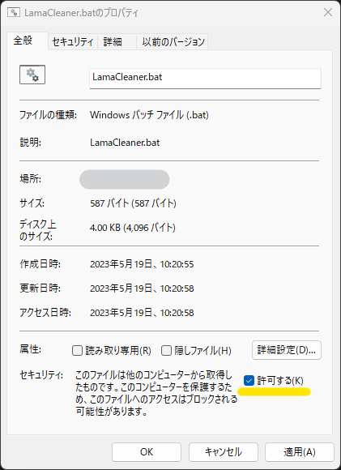

# モノを消すだけじゃない！Lama Cleaner の簡単で多様な高コスパ修正

概要紹介は[こちら](https://twitter.com/Zuntan03/status/1660197068143747077)。

「[Lama Cleaner](https://github.com/Sanster/lama-cleaner)」は画像の中にあるモノを消すためだけのツールと思われがちですが、少ない手間でいろんな修正ができる高コスパなツールでもあります。  
手間の少なさはやってみないとわかりませんが、マウスでちょいちょいと作業するだけで大きな効果があります。

どれだけ簡単に・どれだけいろんな修正ができるのかといった LamaCleaner のクセを紹介して、「惜しい、ガチャ失敗、雰囲気はいいのに…」とあきらめていた画像が「それを捨てるなんてとんでもない！」となればと思います。

LamaCleaner の操作は線を引く操作ではなく、マスクを置く操作です。  
液晶タブレットを持っていなくても、マウスでも全く問題なく操作できますのでご安心ください。  
マスクの厳密な位置合わせでは、位置を決めてからクリックで確定するマウスのほうが便利なこともあるぐらいです。

- [LamaCleaner のインストール](#lamacleaner-のインストール)
- [LamaCleaner の使い方](#lamacleaner-の使い方)
- [いろいろな修正](#いろいろな修正)
- [ノウハウや注意点](#ノウハウや注意点)

# LamaCleaner のインストール

- AI 画像生成の「簡単ローカル環境」を導入している場合は、`LamaCleaner.bat` を実行すればブラウザで開きます。  
	- 初回起動時はインストールに数分かかります。
	- LamaCleaner のブラウザを閉じてしまった場合は、コマンドプロンプトの先頭にある [`http://localhost:7859/`](http://localhost:7859/) を Ctrl+左クリックしてください。
- 「簡単ローカル環境」を導入されていない方は「[LamaCleaner.bat](https://raw.githubusercontent.com/Zuntan03/SdWebUiTutorial/main/LamaCleaner.bat)」のリンクを右クリックから「名前を付けてリンク先を保存...」し、適当なフォルダに置いて実行することでも利用できます（要 Git & Python）。
	- ダウンロードした `LamaCleaner.bat` を右クリックして「プロパティ」を開き、「全般」の「セキュリティ」を「許可する」と実行時の「Windows によって PC が保護されました」警告を表示しないようにできます。  
	
- 公式のインストールや利用の手順は[こちら](https://github.com/Sanster/lama-cleaner)を参照してください。

ワコムのタブレットで Lama Cleaner を用するには、Windows Ink を無効化してください。

# LamaCleaner の使い方

1. ブラウザの LamaCleaner に修正したい画像をドラッグ＆ドロップします。
2. ブラシの太さを変えながら線を引いて修正します。
	- 修正結果が気に入らない場合は Ctrl+Z やボタンでアンドゥします。
3. 修正が終わったらダウンロードボタンでファイルを保存します。
	- **元のファイルを上書きしないように注意してください。**  
	元のファイルを上書きすると、SdWebUi の生成パラメータの情報が失われます。

右上のキーボードボタンでショートカットを確認できます。

# いろいろな修正

## いらない髪束を消したり、ぐにゃった線を整えたり

髪束の終端をマスク外として残したり、髪束の幅の片側だけをマスクしたりすることで、挙動が変わります。

## 浮き出たあばらをまろやかに

ブラシを太くすると、よりまろやかになります。  
サンプルはまとめて修正していますが、一箇所ずつ修正（ダメならUndo）を繰り返してください。

## マッチョ度合いをまろやかに

ブラシを太くすると、よりまろやかになります。  
サンプルはまとめて修正していますが、一箇所ずつ修正（ダメならUndo）を繰り返してください。

手足の筋肉も同様に対処できます。

## いらない指を消す

手にありがちな、長い指やよくわからない突起物も削除できます。  
他にも耳やあほ毛や乳首が増えたといった、体のパーツが増える系に（消しても自然なら）対処できます。

## いらない手足を消す

3本目の腕や脚も、自然に消せるモノであれば簡単に消せます。

## 文字を消す

文字が絵に被っていても削除できます。  

## いらないモノを消す

TileTileでアップスケールしたら手が生えてきたので、元画像から化ける元になったモノを削除しています。

## こびとを消す

アップスケールで発生したこびとも、位置がわかれば削除できます。

# ノウハウや注意点

- マスクの境界部分に何が含まれていて、何が含まれていないかで挙動が大きく変わりますので、イロイロと試してみてください。  
	- モノの一部がマスク外に出ていると、モノを削除せずにならすような挙動になったりします。
- LamaCleaner で削除修正が簡単にできるため、「CFG スケール」や LoRA などの各種ウェイトを高めに設定したりします。
	- 例えば4本指の手に指を追加するのは手間がかかりますが、LamaCleaner で6本指を5本にするのは一瞬です（ただし、消しても自然な指がある場合に限る）。
- LamaCleaner の修正で周囲に多少のにじみがあっても、後のアップスケールで自動的に解決する場合があります。
	- 最終調整時以外の修正のこだわりは、ほどほどにするのがオススメです。
	- アップスケールで思いもよらない結果になかったから、元絵を LamaCleaner で修正することもよくあります。
- LamaCleaner で修正しにくいモノは、LamaCleaner でがんばっても修正することは難しいです。
	- 簡単に修正できるモノだけを、簡単に修正するツールです。
		- 簡単に修正できるモノを見分けられるようになると、とてもコスパの高い修正ツールになります。
	- うまく修正できない場合は、早めにあきらめるか別の手段を検討しましょう。
- 修正した png からは SdWebUi の生成情報が失われてしまいます。
	- 元となったオリジナルの png はアップスケールなどに使うので、ちゃんと保存しておきましょう。
