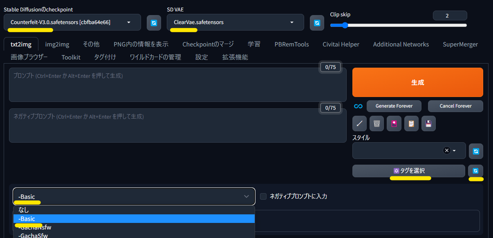
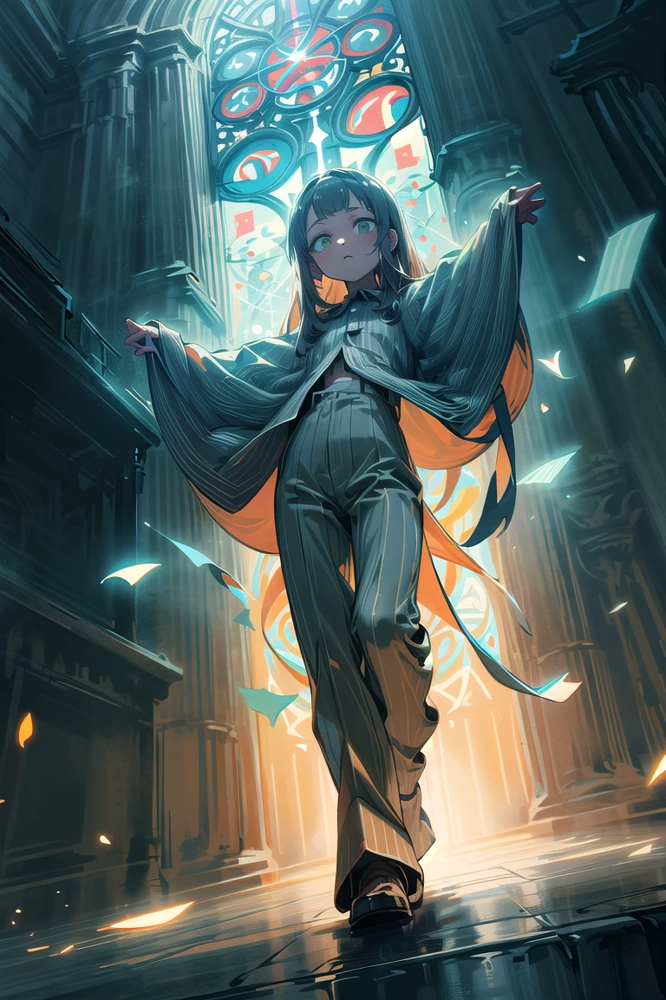
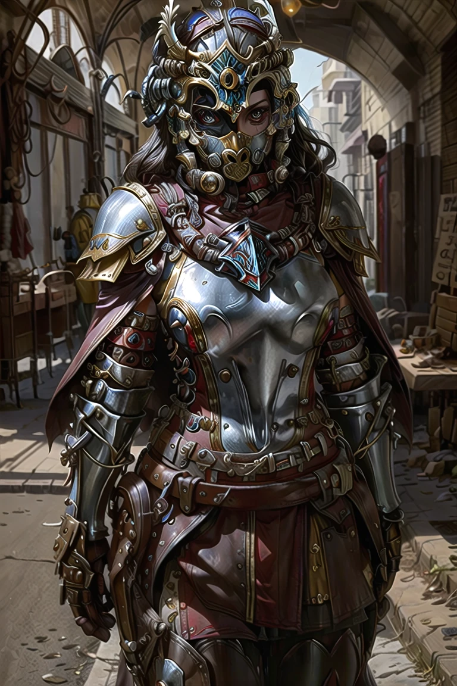
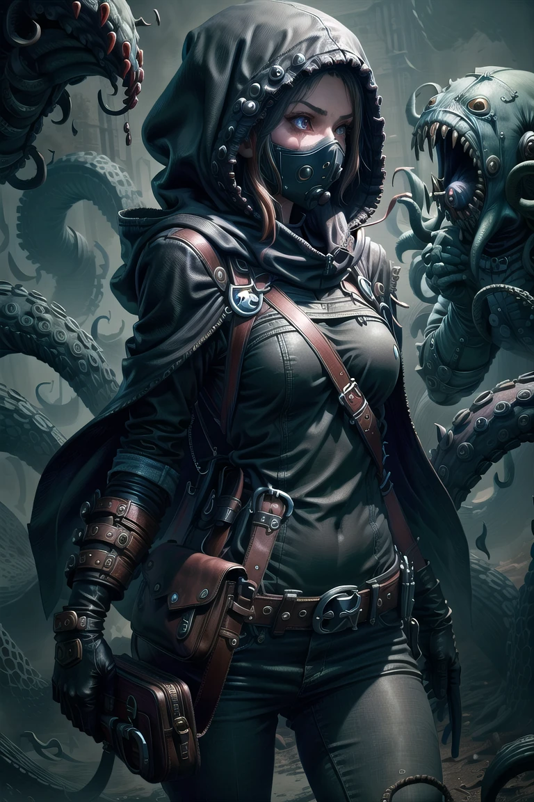
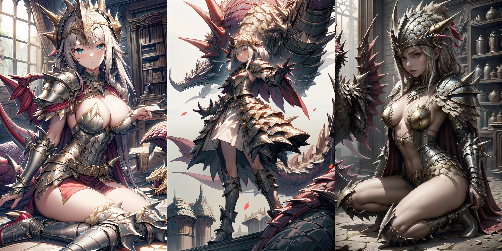
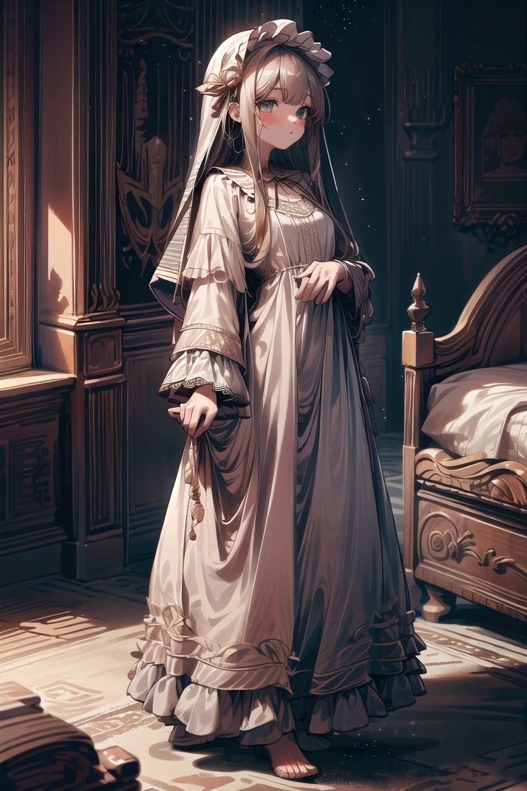
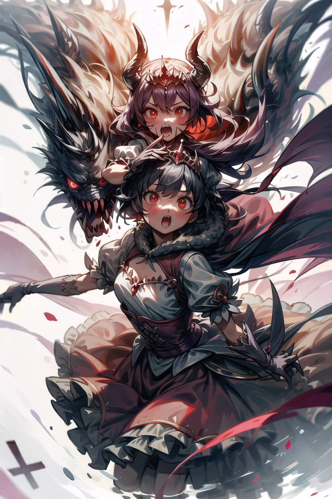

# 簡単ポチガチャでステキな絵を探究する

ボタンをポチポチするだけで簡単にガチャれるポチガチャで、ステキな絵を探究するチュートリアルです。

**ポチガチャの主な特徴**
- ボタンを押すだけで難しいプロンプトの記述が不要
	- [Dynamic Prompt](https://github.com/adieyal/sd-dynamic-prompts) を記述せずとも、[Easy Prompt Selector](https://github.com/blue-pen5805/sdweb-easy-prompt-selector) のボタンだけでガチャれます。  
	
- セットアップ不要
	- [bat を実行するだけの簡単ローカル環境のセットアップ](https://github.com/Zuntan03/SdWebUiTutorial/blob/main/_/doc/SdWebUiInstall/SdWebUiInstall.md)で、Wildcard の txt や Easy Prompt Selector の yaml といった設定ファイルを自動で用意します。
	- このチュートリアルの公開前に簡単ローカル環境を導入済みであった場合は、「[SdWebUi の更新](https://github.com/Zuntan03/SdWebUiTutorial#sdwebui-%E3%81%AE%E6%9B%B4%E6%96%B0)」をしてください。
- LoRA のガチャに対応
	- 簡単ローカル環境で LoRA の存在や名前を保証できるため、トリガーワードも含めた LoRA ガチャを実現できます。
		- 種類はまだ少ないですので、おすすめの LoRA ガチャの組み合わせアイデアがありましたら[お知らせください](https://twitter.com/Zuntan03)。
- Sfw (Safe For Work)、Nsfw (Not Sefe For Work) 両対応

----

ポチガチャと普通のガチャを組み合わせて利用することもできますので、チュートリアルでは SdWebUi での普通のガチャり方も紹介します。

- [はじめに](#はじめに)
- [シードでガチャる](#シードでガチャる)
- [Dynamic Prompt でガチャる](#dynamic-prompt-でガチャる)
- [Easy Prompt Selector でガチャる](#easy-prompt-selector-でガチャる)
- [ポチガチャる](#ポチガチャる)
- [LoRA でガチャる](#lora-をガチャる)
- [まとめ](#まとめ)
- [ガチャ絵ギャラリー](#ガチャ絵ギャラリー)

# はじめに

AI 画像生成の使いこなしには「AI を使って思った通りの絵を出す」と「想像もしなかった絵を AI に出してもらう」の、ふたつの方向性があります。

「思った通りの絵を出す」は、LoRA によるキャラ再現や ControlNet による制御などで、AI 画像生成による動画作成などが今のところこの方向性に近いです。「思った通りの絵を出す」ための技術は日々急速に進化していますが、再現度が高くなるほど人の指示以上のものが出にくくなったり、人の指示作業が AI の生産力に歯止めをかけるといったジレンマがあります。

「想像もしなかった絵を出してもらう」は、AI 画像生成の生産力と組み合わせ爆発をかけ合わせて多種多様な絵を出力します。ただし、大量の出力に良いモノが含まれる打率を高める方法や、大量の出力から良いモノを効率的に選ぶ方法に課題があります。

今回のチュートリアルは後者の「想像もしなかった絵を出してもらう」の多様な出力を簡単に実現するためのものですが、打率向上や選択効率の課題はまだ解決できていませんのでご了承下さい。  
ガチャ用の Dynamic なプロンプトをがんばって用意したにも関わらず結果が伴わないととても残念ですが、ボタンポチポチでガチャを回す分には気楽に回せるんじゃないでしょうか。

もちろん「LoRA でキャラなどを再現しつつ、これらと組み合わせつつも想像もしなかった絵を出してもらう」ことも可能です。

# シードでガチャる

SdWebUi で同じプロンプトや設定で生成する絵が毎回異なるのは、疑似ランダムの元となる「シード」が毎回異なる値になっているためです。  
色々細かな話はあるのですが、ここでは「**シードを同じ値にすれば、似たような絵を再出力できる**」だけ覚えておいてください。

シードは SdWebUi の以下の場所で設定します。

- 「シード」が「-1」だと毎回異なるシードを元にした疑似ランダムで異なる絵が出力され、ガチャれます。
	- ただし「XYZ plot」などの一部機能では、同一条件での比較をするために複数の絵に同じシードが使われたりします。
- サイコロのボタンは「シード」を「-1」のランダムシードに設定し直します。
- リサイクルのボタンは直前に生成した絵の「シード」を設定します。
	- 良い絵が出た際に、同じシードで他の条件を変えつつ絵を出力するのに使います。

「シード」が「-1」なら毎回違った絵が出力されてガチャれる、「シード」を固定しつつ他の設定でガチャることもある、あたりがポイントです。

----

1. 「Stable Diffusionのcheckpoint」で「Counterfeit-V3.0」モデルを指定します。
2. 「SD VAE」に「ClearVae」を指定します。
3. 「生成ボタン」下の「タグを選択」でリストを表示し、「-Basic」を選択します。
	- リストに「-Basic」が見当たらない場合は「タグを選択」ボタン右の更新ボタンを押して、再度「タグを選択」してください。

4.   
新たに表示されたボタンの「1girl」をクリックするとプロンプトに「1girl, 」が入力されます。  
**「EsNg2」を Ctrl を押しながらクリックする**とネガティブプロンプトに「EasyNegativeV2, 」が入力されます。  
**これらのボタンは Ctrl+Click でネガティブプロンプトに入力でき、右クリックで入力したプロンプトを削除できます。**
5.   
「高解像度補助」にチェックをして、「生成」の後に画像の下の「Seed: 」値を確認します。
6.   
もう一度「生成」すると絵と画像の下の「Seed: 」が変わります。  
画像の下の「Seed: 」の値を「シード」にコピペして「生成」すると、ほぼ同じ絵が出力されます。
7. このシードの値による絵の変化が「シードによるガチャ」です。  
忘れないように「シード」右側のサイコロボタンで「シード」の設定をランダムの「-1」に戻します。

# Dynamic Prompt でガチャる

[Dynamic Prompt](https://github.com/adieyal/sd-dynamic-prompts) は特別なプロンプト記法を追加する拡張機能です。

- プロンプトの「`#`」から行末までをコメントにして、絵の生成に影響しないようにします。
	- プロンプトの一部分を一時的に無効化したい時に使えます。
- プロンプトに「`{A|B}`」のように記述すると、A か B のいずれかで絵を生成します。
	- 「`{A|B|}`」なら A か B か**記述ナシ**のいずれかで絵を生成します。
	- 「`{2$$A|B|C`}」なら A,B か A,C か B,C のいずれかで絵を生成します。
		- 「`{1-2$$A|B|C}`」なら A か B か C か A,B か A,C か B,C のいずれかで絵を生成します。「`{1-$$A|B|C}`」なら A,B,C を追加です。
- プロンプトで「\_\_ワイルドカードパス\_\_」と記述すると、テキスト形式のワイルドカードファイルからいずれかの行を選択して絵を生成します。
	- ワイルドカードファイルを置くワイルドカードフォルダは「SdWebUi\stable-diffusion-webui\extensions\sd-dynamic-prompts\wildcards」です。
		- プロンプトではワイルドカードフォルダからのワイルドカードファイルの相対パスを指定します。
	- このチュートリアルではすでに事前に用意したワイルドカードファイルを使用します。
		- 自分でワイルドカードファイルを用意して、ワイルドカードフォルダに置いて利用することもできます。

プロンプトの「`{ red | blue }`」で赤と青を切り替えたり、「`{ apple | }`」でりんごを出したり出さなかったりとガチャれます。

----
1.   
プロンプトの先頭に「`#`」を入力して「`1girl`」をコメントアウトします。  
改行した次の行に「`{ 1woman | 1boy }`」をコピペして、何度か「生成」します。
2.   
生成した絵の内容とプロンプトを確認し、「`1girl`」が含まれず、「`1woman`」と「`1boy`」がランダムで選ばれていることを確認します。
3. このプロンプトのランダム化による絵の変化が「Dynamic Prompt によるガチャ」です。  
Dynamicプロンプトは複数指定することも、入れ子で指定することもできますので、簡単に組み合わせ爆発を起こせます。  
忘れないようにプロンプトを「`1girl,`」のみに戻します。  
プロンプト入力欄で Ctrl+Z のアンドゥ数回でも戻せます。

# Easy Prompt Selector でガチャる

[Easy Prompt Selector](https://github.com/blue-pen5805/sdweb-easy-prompt-selector) はボタンで簡単にプロンプトを入力できるようにする拡張機能です。  
いずれかのボタンをボタンのグループからランダムで選ぶ機能があり、この機能を使ってガチャれます。

Easy Prompt Selector の使い方は、作者である [ぶるぺんさん](https://note.com/blue_pen5805/) の Blog「[プロンプト入力を楽にする拡張機能を作りましたの回](https://blue-pen5805.fanbox.cc/posts/5306601)」で詳しく解説されています。

----
チュートリアルでは [BD さん](https://note.com/br_d/) が公開されている「[ぶるぺんさん拡張機能用yml置き場](https://br-d.fanbox.cc/posts/5680274)」の Easy Prompt Selector 用の yml 設定ファイルを使用します。
各プロンプトの出力例も丁寧に解説されていますので、見てみることをオススメします。

1.   
Easy Prompt Selectorのタグを選択するリストから「BD_ファンタジーコーデ」を選び「ファンタジーコーデ」ボタンを押すと、プロンプトに「`@BD_ファンタジコーデ:ファンタジーコーデ@`」が追加されます。  
「生成」すると様々な服装の画像が生成されます。
2.   
「ファンタジーコーデ」と同じように、「BD_旅」から「旅」を、「BD_感情」から「感情」をクリックして、プロンプトを `1girl, @BD_ファンタジコーデ:ファンタジーコーデ@, @BD_旅:旅@, @BD_感情:感情@` とします。
3. プロンプトが用意できたら「生成」ボタン下の「Generate Forever」を押すと、様々な場面の画像が生成され続けます。
4. 「SdWebUi.bat」と同じフォルダにある「`GenImageViewer.bat`」 を立ち上げると、生成され続ける画像を自動的に大きく表示できます。  

5. イイカンジで様々な画像が生成されるので、別のモデルではどうなるかを確認してみます。  
  
左下の「スクリプト」から「X/Y/Z plot」を選び、「AnythingV5」「Couterfeit-V3.0」「ReVAnimated」を選んで生成します。
6. 同じプロンプトを違うモデルで生成したかったのですが、Easy Prompt Selector のランダム機能はモデルごとにプロンプトをガチャってしまうようです。  

# ポチガチャる

「X/Y/Z plot」で同じガチャ結果のプロンプトを複数のモデルで出力してみるために Dynamic Prompt の Wildcard 機能でガチャります。

1. プロンプトを Ctrl+A で全選択してからの Delete で全削除します。
2. 「タグを選択」のリストから「-GachaSfw」を選択します。

3. 「[NaiWc](https://rentry.org/NAIwildcards)」の「場所」、「1girl」、「[ことさん](https://drive.google.com/file/d/1vfRyX9EQKkJ5V_aFvNCyvr0tAnhp9wRr/view?usp=share_link)」の「服全種」の順に押して、プロンプトを `__NaiWc/Location__, 1girl, __Tsak/ClothingSet/ftbClothingset__` にします。
4. 「X/Y/Z plot」で指定したそれぞれのモデルで、同じガチャ結果プロンプトでの出力を確認できます。

# LoRA でガチャる

では最後に LoRA でもガチャってみましょう。

1. 「-GachaSfw」の「KonyconiAiスタイル」と、ついでに「詳細2」も付け足します。  
プロンプトに `__LoraWc/KonyconiStyleAi__:1:BIimOO>, <lora:Flat-DetailV2:-1:biimoO>` が付け足されます。  

	- 今回は複数の LoRA をそのまま利用していますが、複数の LoRA を使用する場合は LoRA のウェイトや「CFG スケール」を下げることで、ガチャの打率が高まる場合があります。
	- LoRA のガチャは Wildcard 行の前半にキーワードプロンプトを、後半に LoRA 定義を記載しています。  
	`:1>` といった記述を Wildcard 外に出すことで、LoRA のウェイト調整や LoRA Block Weight 適用を可能にしています。
2. 「Generate Forever」すると LoRA でスタイリングされた絵が次々と出力されますので、GenImageViewer で眺めましょう。

LoRA のガチャはまだ少ないですが、おすすめの LoRA ガチャの組み合わせアイデアがありましたら[お知らせください](https://twitter.com/Zuntan03)。

以降では上記設定での LoRA ガチャ結果を**未修正で**紹介します。  
ガチャ後のプロンプト設定などが入った png は、[こちら](https://yyy.wpx.jp/m/f/23/PochiGachaPng-20230514.zip)からダウンロードできます。

**ガチャでは手指などの細部の破綻をあまり気にしないでください。**  
**気に入った絵は AI による後処理で簡単に細部を修正できます。**

**AI による簡単な後処理でどのくらい絵が変わるかの一例です。手指の修正だけでなく、表情や足の本数まで変わります。**  
**「AI による簡単後処理で、さらにこのぐらい絵が変わるもの」として、ガチャ結果を見てください。**

画像を右クリックして「新しいタブで画像を開く」で大きく表示できます。
||||||
|:--:|:--:|:--:|:--:|:--:|
||||||
||||||
||||||
||||||
||||||

X/Y/Z plot による3モデル同時生成でのガチャ結果
|Anything\|Counterfeit\|ReVAnime|Anything\|Counterfeit\|ReVAnime|Anything\|Counterfeit\|ReVAnime|
|:--:|:--:|:--:|
||||
||||
||||
||||
||||
||||
||||
||||

# まとめ

- AI の生産力と組み合わせ爆発は相性が良いですね。
	- 特に LoRA ガチャは影響力が強いのですが、これからどのように整備するのかも悩ましいです。
- ガチャの打率を上げるのも、当たりを効率的に探すのも、やはり悩ましいです。
- Easy Prompt Selector は起動時にデフォルトでタグを選択できたり、「タグを選択」ボタンがタグ選択ドロップダウンに差し替わると良さそうな気がしました。
	- この空間がもったいないな～と。まぁ、OSS ですので本気でやりたきゃ自分でやってプルリクしろよ、ですが。  
	
		- 「ネガティブプロンプトに入力」は「Ctrl + Click を使ってください」で廃止するか、タグ更新ボタンの右に「□ Ng」とでも付けてしまうか…。
- Nsfw はお好みの LoRA などに「NaiWcNsfw」を雑に並べて「Generate Forever」すると、`GenImageViewr.bat` でずっと眺められます。
- ガチャの打率向上と後処理については、次回のチュートリアル更新で解説するつもりです。

# ガチャ絵ギャラリー

LoRA ガチャ結果のプロンプト設定などが入った png は、[こちら](https://yyy.wpx.jp/m/f/23/PochiGachaPng-20230514.zip)からダウンロードできます。

画像を右クリックして「新しいタブで画像を開く」で大きく表示できます。
||||||
|:--:|:--:|:--:|:--:|:--:|
||||||
||||||
||||||
||||||
||||||
||||||
||||||
||||||
||||||
||||||
<!--||||-->

X/Y/Z plot による3モデル同時生成でのガチャ結果
|Anything\|Counterfeit\|ReVAnime|Anything\|Counterfeit\|ReVAnime|Anything\|Counterfeit\|ReVAnime|
|:--:|:--:|:--:|
||||
||||
||||
||||||||
||||
||||
