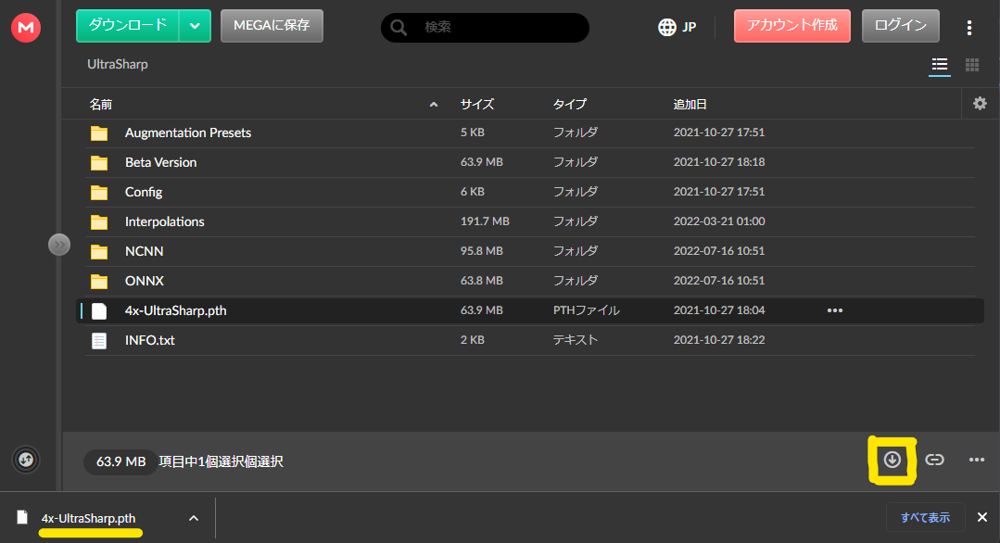

# Stable Diffusion web UI のインストール

画像生成 AI ツールの [Stable Diffusion web UI](https://github.com/AUTOMATIC1111/stable-diffusion-webui)(SdWebUi) を簡単にインストールして使えるようにします。

1. [動作環境](#動作環境)
2. [Git for Windows のインストール](#git-for-windows-のインストール)
3. [Python のインストール](#python-のインストール)
4. [SdWebUi のインストール](#sdwebui-のインストール)
5. [アップスケーラーの手動ダウンロード](#アップスケーラーの手動ダウンロード)

# 動作環境

- Windows 10 以降の PC
	- Windows Update 適用済
- 最近の NVIDIA 製ビデオカード
	- 動作確認は Geforce RTX 3060 12GB で実施
- 200GB 程度のディスク容量

成人向けのモデルや Lora を含みますので、成人でない方の利用は禁止です。  
ファイルのダウンロード時に配布元の URL をコンソールに表示します。URL を Ctrl + Click で開き、利用規約などを遵守してご利用ください。

# Git for Windows のインストール

[Git for Windows](https://gitforwindows.org/) はファイルの履歴を管理するツールですが、生成 AI 関連では様々なモノのダウンロードによく使用します。  
Git をインストール済みで、パスも通っている方は[読み飛ばしてください。](#python-のインストール)

[公式サイト](https://gitforwindows.org/)の「Download」からインストーラーをダウンロードして実行します。  

**インストール時の次の画面では、真ん中を選んでください。**

このオプションで PC のどのフォルダからでも git を呼び出せるようになります。

他のオプションはデフォルトのままでも問題ありません。  
もし気になるオプションがあったら、[調べてみてください](https://www.google.com/search?q=Git+for+Windows+%E3%82%A4%E3%83%B3%E3%82%B9%E3%83%88%E3%83%BC%E3%83%AB)。

# Python のインストール

[Python](https://www.python.org/) は有名なプログラミング言語で、AI 分野では特に活発に利用されています。  
[SdWebUi が指定している ](https://github.com/AUTOMATIC1111/stable-diffusion-webui/wiki/Dependencies) **最新ではないバージョンの** [Python 3.10.6](https://www.python.org/ftp/python/3.10.6/python-3.10.6-amd64.exe) をインストールします。

Python 3.10.6 をインストール済みで、パスも通っている方は[読み飛ばしてください。](#sdwebui-のインストール)

SdWebUi が使用する Python のバージョンは [Dependencies](https://github.com/AUTOMATIC1111/stable-diffusion-webui/wiki/Dependencies) で確認できます。  
「[exe](https://www.python.org/ftp/python/3.10.6/python-3.10.6-amd64.exe)」のリンクからインストーラーをダウンロードして実行してください。

**インストール時の次の画面では[公式の指定](https://github.com/AUTOMATIC1111/stable-diffusion-webui#automatic-installation-on-windows)にそって、以下のパスを追加するオプションを有効にしてください。**

git と同様に、このオプションで PC のどのフォルダからでも python を呼び出せるようになります。

パスの追加を忘れた場合はPythonのインストーラーをもう一度実行し、「Modify」-「Next」-「Add Python to environment variables」であとからパスを追加することもできます。

# SdWebUi のインストール

まず、インストール先のフォルダを英数字のみの浅いパスに用意します（例: `C:\SdWebUiTutorial\` や `C:\SD\` など）。  

SdWebUiのインストールには、基本インストールとすべてをインストールするオプションがあります。  
すべてをインストールは 100GB 超えのダウンロードをしますのでご注意ください。  
基本インストールのオプションでは、個別に追加のファイルをダウンロードすることもできます。

次のどちらかの bat ファイルを **右クリックから「名前をつけてリンク先を保存…」** でインストール先のフォルダにダウンロードします。

- [`Setup_SdWebUi.bat`](https://github.com/Zuntan03/SdWebUiTutorial/raw/main/_/SdWebUi-Installer/Setup_SdWebUi.bat)（基本構成）
	- 基本構成では動作に必要な [VAE 一覧](https://github.com/Zuntan03/SdWebUiTutorial/tree/main/_/SdWebUi-Installer/Vae)・[TI 一覧](https://github.com/Zuntan03/SdWebUiTutorial/tree/main/_/SdWebUi-Installer/Embedding)・[拡張一覧](https://github.com/Zuntan03/SdWebUiTutorial/tree/main/_/SdWebUi-Installer/Extension)・[ControlNetModel 一覧](https://github.com/Zuntan03/SdWebUiTutorial/tree/main/_/SdWebUi-Installer/ControlNetModel)・[AbyssOrangeMix2Sfw](https://huggingface.co/WarriorMama777/OrangeMixs/),・[BasilMix](https://huggingface.co/nuigurumi/basil_mix) をダウンロードします。
	- `_\SdWebUi-Installer\Model\` や `_\SdWebUi-Installer\Lora\` にある bat ファイルで、モデルやLoRA を追加で個別にダウンロードできます。
	- 時間のある時に「[リソースの更新](../../../README.md#%E3%83%AA%E3%82%BD%E3%83%BC%E3%82%B9%E3%81%AE%E6%9B%B4%E6%96%B0)」でモデルや LoRA を追加でダウンロードします。
	- 以降の説明は `SetupAll_SdWebUi.bat` で進めますので、読み替えてください。
- [`SetupAll_SdWebUi.bat`](https://github.com/Zuntan03/SdWebUiTutorial/raw/main/_/SdWebUi-Installer/SetupAll_SdWebUi.bat)（全部入り、100GB 超えダウンロード）
	- 基本構成に加え [Model 一覧（巨大）](https://github.com/Zuntan03/SdWebUiTutorial/tree/main/_/SdWebUi-Installer/Model)・[LoRA 一覧](https://github.com/Zuntan03/SdWebUiTutorial/tree/main/_/SdWebUi-Installer/Lora) をダウンロードします。
 
インストール先のフォルダで `SetupAll_SdWebUi.bat` をダブルクリックすると SdWebUi 関連のダウンロードとインストールを進めます。  
モデルや LoRA は主に [Civitai](https://civitai.com/) からファイルをダウンロードしますので、[Civitai](https://civitai.com/) が落ちていない時に bat を実行してください。

**「WindowsによってPCが保護されました」と表示されたら、「詳細表示」から「実行」します。**  

インストールが終わるとブラウザに SdWebUi が表示されますので、上部タブから「Civitai Helper」を選択して、「Scan Models for Civitai」で「Scan」します。  

スキャンが終わったら、上部タブの「txt2img」に戻って花札マークの「extra networks」から「リフレッシュ」と「Refresh Civitai Helper's additional buttons」をします。  

これにより [Civitai](https://civitai.com/) にあるモデルや LoRA のプレビュー画像が表示され、LoRA のキーワードを自動的に入力できるようになります。  
つかいかたは「[Civitai からのモデルや LoRA のダウンロード](../DownloadFromCivitai/DownloadFromCivitai.md)」で解説してます。

**以降は「SdWebUi.bat」をダブルクリックすれば SdWebUi を実行できます。**

# アップスケーラーの手動ダウンロード

クラウドストレージである「[MEGA](https://mega.io/ja/)」にあるファイルを自動でダウンロードするには MEGA 専用プログラムのインストールが必要になります。  
MEGA 専用プログラムのインストールは億劫ですので、手動で簡単にファイルをダウンロードするしくみを「`_\SdWebUi-ManualDownload\`」以下に用意しました。

ここでは MEGA で配布されている画像拡大アップスケーラー「`4x-UltraSharp.pth`」と「`4x-AnimeSharp.pth`」をダウンロードします。

1. エクスプローラーで「`_\SdWebUi-ManualDownload\Upscaler\`」を開くと「`4x-UltraSharp.bat`」と「`4x-AnimeSharp.bat`」があります。
2. bat を実行すると Web ブラウザでダウンロードページを開き、エクスプローラーでとファイルのインストール先を開きます。
3. ダウンロードページからファイルをダウンロードする際には、左上ではなく右下の「（↓）」ダウンロードボタンでダウンロードします。

4. ダウンロードが終わったら「フォルダを開く」でダウンロード先フォルダからインストール先フォルダにファイルを移動します。

他にも「[MEGA](https://mega.io/ja/)」からしかダウンロードできないものは、「`_\SdWebUi-ManualDownload\`」以下にダウンロード用の bat ファイルがあります。

「[MEGA](https://mega.io/ja/)」からの無料ダウンロードは、大きなサイズをダウンロードをすると一定時間（6時間以上）ダウンロードが制限されます。  
制限されたら翌日などにダウンロードを試しましょう。

# 次は

以上で SdWebUi のインストールは完了です。

[最初の 1girl 画像生成](../First1Girl/First1Girl.md) で「1girl, school uniform」と簡単に指定するだけで、以下のような画像を生成します。

