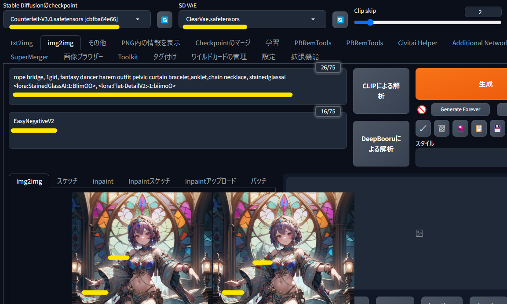
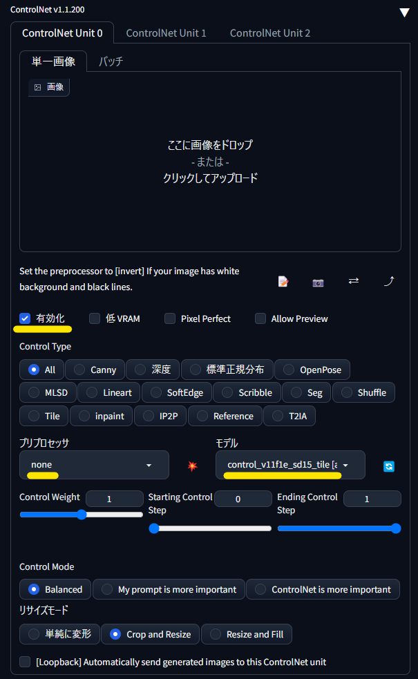
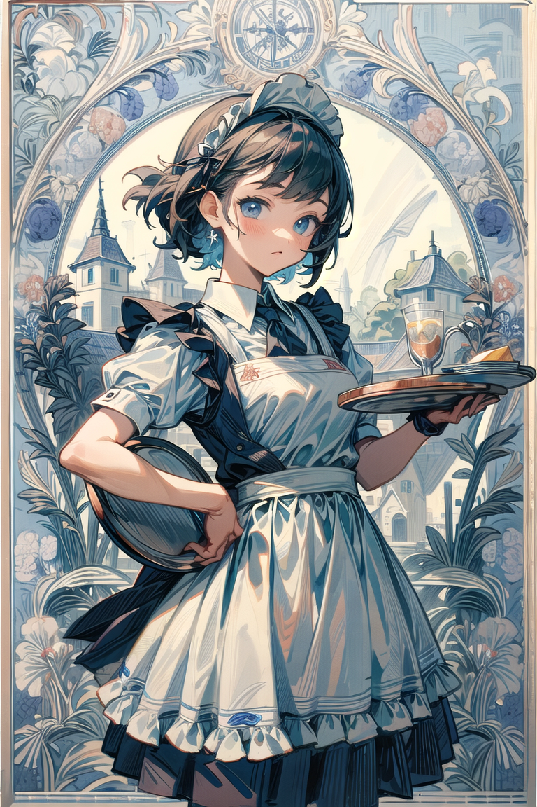

# 高コスパ！簡単ゴージャスアップスケール！

<!-- TODO: 概要紹介は[こちら]()。-->

[Tiled Diffusion & VAE](https://github.com/pkuliyi2015/multidiffusion-upscaler-for-automatic1111) と [ControlNet Tile](https://github.com/Mikubill/sd-webui-controlnet) によるアップスケール（Tile アプスケ）を、コスパとゴージャスな書き込みに尖らせて利用します。

Geforce RTX 3060 で 2K 2分程度、4K 6～7分程度で Tile アプスケできます。  
設定やキャッシュなどの状況によっては、4K が 4分半を切ったりもします。

今回の高コスパな Tile アプスケでは、公式で 200 ともされている Inversion steps の計算量を 15 まで大幅に下げています。
少ない計算量でゴージャスさを維持するために、img2img でもなるべく txt2img と同様の絵を生成して、txt2img のディティールをそのまま強調する考え方です。  

- [動作環境](#動作環境)
- [アップスケール元の画像](#アップスケール元の画像)
- [Tile アプスケの手順](#tile-アプスケの手順)
	- [プロンプトの設定](#プロンプトの設定)
	- [img2img の設定](#img2img-の設定)
	- [Tiled Diffusion & VAE の設定](#tiled-diffusion--vae-の設定)
	- [ControlNet Tile の設定](#controlnet-tile-の設定)
	- [最初の Tile アプスケ](#最初の-tile-アプスケ)
	- [X/Y/Z plot で最適化](#xyz-plot-で最適化)
	- [2度目のアップスケール](#2度目のアップスケール)
	- [仕上げ](#仕上げ)
- [Tile アプスケギャラリー](#ギャラリー)

# 動作環境

「簡単ローカル環境」をご利用なら、自動インストール済みでセットアップ不要です。  
https://github.com/Zuntan03/SdWebUiTutorial/

ご利用でない方は、以下を [Stable Diffusion web UI](https://github.com/AUTOMATIC1111/stable-diffusion-webui) に導入してください。

- [ControlNet 拡張](https://github.com/Mikubill/sd-webui-controlnet)
	- [control_v11f1e_sd15_tile.pth](https://huggingface.co/lllyasviel/ControlNet-v1-1/resolve/main/control_v11f1e_sd15_tile.pth)
- [Tiled Diffusion & VAE 拡張](https://github.com/pkuliyi2015/multidiffusion-upscaler-for-automatic1111)
- [4x-UltraSharp アップスケーラー](https://upscale.wiki/wiki/Model_Database)
	- [4x-UltraSharp.pth](https://mega.nz/folder/qZRBmaIY#nIG8KyWFcGNTuMX_XNbJ_g) を `stable-diffusion-webui\models\ESRGAN\` に置きます。

# アップスケール元の画像

アップスケール元の画像は長辺 768px を `高解像度補助 (Hires. fix)` で 1.5倍にした画像 (`1152px x 1152px` や `768px x 1152px`) を想定しています。  
高解像度補助を 2倍にしていないのは、Hires. ガチャの打率向上のためです。

この画像を 2倍にアップスケールすると、長辺が 2304px の 2K+ なサイズになり、さらに 2倍で長辺が 4608px の 4K+ なサイズになります。  
2回目の Tile アプスケは打率が悪くなりがちですので、2K+ で十分であれば、アプスケ完了としても問題ありません。

高解像度補助を 2倍にしている場合は、2倍の Tile アプスケ一回で長辺 3K で着地させるか、倍率を下げて Tile アプスケするかになりそうですね。

2倍を超えるスケールでの Tile アプスケは試した範囲では打率が下がるようですので、2回に分けることをオススメします。

また、2回目のアップスケールを Tile アプスケでなく、書き込みを増やさない通常のアップスケーラーを使う選択肢もあります。

# Tile アプスケの手順

## プロンプトの設定

高解像度補助で生成した画像を「PNG内の情報を表示」で読み込み、「img2imgに転送」します。

- モデルやVAEやプロンプトやネガティブプロンプトは、生成時のものをそのまま使います。
	- プロンプトは意図的に空欄にせず、LoRA やネガティブ TI を残しています。  
	生成した画像でこれらの影響が強すぎる場合は、削除したり重みを下げたりします。
	- VAE は `kl-f8-anime2` にすると彩度や **書き込み** を高められ、`orangemix` にすると抑えられます。
- [LamaCleaner](https://github.com/Zuntan03/SdWebUiTutorial/blob/main/_/doc/LamaCleaner/LamaCleaner.md) や inpaint で修正した画像があれば、ドラッグ＆ドロップで設定します。
	- 上の例では手の形状や、前後関係のおかしい建物を修正しています。
	- 手は Tile アプスケの書き込みを想定して、かなり雑な修正をしています。  
	雑な修正ですが Tile アプスケで誤魔化せます。  
	

## img2img の設定

img2img の設定では `CFGスケール` と `ノイズ除去強度` を、ゴージャスにしたい・盛りたい・書き込みたい分量にあわせて設定します。

- `CFGスケール`
	- 6以下: おとなしめ
	- 8 ~ 10: 普通盛り
	- 12以上: メガ盛り
- `ノイズ除去強度`
	- 0.4: 絵の色味を守るが、盛りはおとなしめ
	- 0.6: ちょっと色味が変わるが  `kl-f8-anime2` でごまかせる範囲？普通盛り
	- 0.8以上: ガンガン盛るが、絵の色味がさらに変わって背景がボケたりも
		- 色味の変化を許容するか、あとで画像処理系ソフトで修正するか

`CFGスケール` と `ノイズ除去強度` 以外は、元絵の生成パラメータのままです。

## [Tiled Diffusion & VAE](https://github.com/pkuliyi2015/multidiffusion-upscaler-for-automatic1111) の設定

[公式の案内](https://github.com/pkuliyi2015/multidiffusion-upscaler-for-automatic1111#-combine-with-controlnet-v11-tile-model) から設定をいくつか変更をします。

- [簡単ローカル環境](https://github.com/Zuntan03/SdWebUiTutorial/
) を利用していればデフォルトの UI 設定を変更済みですので、**`Enable Tiled Diffusion` と `Enable Noise Inversion` と `Enable Tiled VAE` を有効にするだけ**です。
	- 設定内容は [`ui-config.json`](https://github.com/Zuntan03/SdWebUiTutorial/blob/main/_/SdWebUi-Installer/ui-config.json) を参照してください。

- `Enable Tiled Diffusion` を有効にして、以下を設定します。
	- `Method` は公式の `Mixture of Diffusers`
	- `Latentタイルの重なり幅` は公式でオススメされている `8` を指定します。  
		- デフォルトの `48` のままだと、アプスケ時間がかなり長くなります（特に 4K）が品質はそこまで上がりません。
	- `アップスケーラー` は `4x-UltraSharp` や `R-ESRGAN 4x+` などをお好みで。
	- `倍率` は試した感触では 2倍まで。
- 忘れずに `Enable Noise Inversion` を有効にして、以下を設定します。
	- 処理時間に大きく関わる `Inversion steps` を 15 まで下げます。
	- 公式と同じく `Renoise strenght` を 0 にします。
- 忘れずに `Enable Tiled VAE` を有効にします。
- その他
	- 右側の `Free GPU` は Noise Inversion のキャッシュをクリアして、メモリを整理します。  
	Python と Torch のガベージコレクションを呼ぶのにも使えます。
	- [After Detailder](https://github.com/Bing-su/adetailer) を元画像の生成に使用していた場合は、無効にしてください。

## [ControlNet Tile](https://github.com/Mikubill/sd-webui-controlnet) の設定

- ControlNet を `有効化` して、`モデル` に `control_v11f1e_sd15_tile` を指定します。
	- **`プリプロセッサ` は指定しません。**
		- `ControlType` で `Tile` を選ぶと、`プリプロセッサ` に `tile_resample` が選ばれてしまいますので `none` に戻してください。

## 最初の Tile アプスケ

設定が終わったらまずは一枚生成してみてから、気になった点を修正します。  
私の Geforce RTX 3600 環境では、2分程度で Tile アプスケが完了しています。  

- アップスケールで色が変わる
	- ControlNet Tile の特性で色が変化します。
		- 色の彩度低下は `VAE` を `kl-f8-anime2.ckpt` にして、ある程度対処できます。
		- マシンスペックに自信がある場合は、ControlNet の `プリプロセッサ` を `tile_colorfix` でも対処できるようです。
- モノが思いもしない変化をする
	- [LamaCleaner](https://github.com/Zuntan03/SdWebUiTutorial/blob/main/_/doc/LamaCleaner/LamaCleaner.md) や inpaint で、元画像や Tile アプスケ済み画像を修正します。
		- やっかいな変化をするモノは、思い切って LamaCleaner で存在を削除してしまうと楽です。
		- **Tile アプスケは書き込みを増やす割には元絵を維持しますので、これまでより元絵に対する修正の価値があがっています。**  
- 白いもやがでる・線がガビガビになる
	- `CFG スケール` や `ノイズ除去強度` を X/Y/Z plot で調整します。
	- 影響力の強い LoRA の強度を抑えることで改善することもあります。

## X/Y/Z plot で最適化

Tile アプスケができることを確認したら、画面左下の `スクリプト` にある `X/Y/Z plot` で最適なパラメータを探ります。

Tile アプスケは書き込みを増やす都合上、絵の内容により結果が大きく異なります。  
より良い絵を得られるパラメータがありそうかの感触を掴むためにも、アプスケの速さを活かして一度はプロットしてみることをオススメします。  

1. `CFG Scale` を `6,9,12` として、書き込む量を幅広く調査します。  
	- 白いモヤや背景の書き込み増減にも影響します。
2. `Denoising` を `0.4,0.6` として、書き換える量を調査します。  
	- 背景のボケに注意してください。
3. `VAE` で色合いや書き込みを調整します。
	- `kl-f8-anime2`: 色が濃くなり、書き込みが増えます。
	- `orangemix`: 色が薄くなり、書き込みが減ります。
	- 他の VEA もお好きに試してください。

画風系の LoRA は Tile アプスケに大きく影響しますので、`Prompt S/R` で `:1,:0.8,:0.6` として LoRA の強度も調査します。

上記はあくまで一例ですので、上記の範囲外の値や異なるパラメータも試してみてください。

X/Y/Z プロットの対象ではありませんが、以下の `Tiled Diffusion` の設定も絵に影響を与えます。

- `アップスケーラー` を変更
- `Noise Inversion` の `Renoise Strength` を増加
- `Noise Inversion` の `Inversion steps` を増加

## 2度目のアップスケール

4K へのアップスケールでは、小人や手の発生にどのように対処するかが課題になります。  
どのようになるかわからないと対処のしようもありませんので、まずはそのままの設定で、2K の画像を img2img の元画像に設定して Tile アプスケを実行してみます。

絵の相性が良い場合は何事もなくアップスケールできますが、相性が悪いと以下のような小人や手が発生します。  

小人への対策はいくつかありますが、いずれも状況に合わせた調整が必要です。

1. `CFG Scale` の書き込み量や `Denoising` の書き換え量を調整する
	- どちらをどの程度調整するのかは [X/Y/Z plot で調べる](#xyz-plot-で最適なパラメータを探る) のが確実です。が、時間がかかります。
		- VAE の種類や LoRA の強度も影響しますので、これらと絡めて寝る前に X/Y/Z plot を仕込むのがオススメです。
2. [LamaCleaner](https://github.com/Zuntan03/SdWebUiTutorial/blob/main/_/doc/LamaCleaner/LamaCleaner.md) や inpaint で 2K の元絵を修正する
	- 小人や手に変化する箇所を修正して、再度 4K への Tile アプスケにかけます。
		- 修正した箇所への書き込みの追加は維持されますが、再アプスケの時間がかかります。
3. [LamaCleaner](https://github.com/Zuntan03/SdWebUiTutorial/blob/main/_/doc/LamaCleaner/LamaCleaner.md) や部分 inpaint や画像処理系ツールで、4K のアプスケ後の絵を修正する
	- 手間をかけた分だけ確実に修正できますが、修正内容によっては書き込みが失われます。
4. 書き込みを盛るのをあきらめて、通常のアップスケーラで拡大する
	- SdWebUi の `その他` の `単一画像` で通常のアップスケールができます。  
	`倍率` を設定して `Upscaler 1` は `R-ESRGAN4x+` や `4x-UltraSharp` や `SwinIR_4x` などお好みで。  
	短時間で拡大できて絵の内容も影響するので、それぞれ出力して見比べても。  
	

2度めのアプスケを控えめにする前提で、1度目のアプスケを積極的に盛るのもオススメです。

- 1度目の 2K アプスケ
	- `CFG Scale`: 12、`Denoising`: 0.6、`SD VAE`: `kl-f8-anime2`
- 2度めの 4K アプスケ
	- `CFG Scale`: 6、`Denoising`: 0.4、`SD VAE`: `orangemix`

## 仕上げ

Tile アプスケが一段落したら仕上げです。

- いろいろとゴミがでがちな手法ですので、 [LamaCleaner](https://github.com/Zuntan03/SdWebUiTutorial/blob/main/_/doc/LamaCleaner/LamaCleaner.md) でいらないものを消します。
- Tile アプスケで変わった色味を調整したい場合は、お好みの画像処理系ツールで。
- PC の壁紙などにする場合は、いい塩梅にリサイズして切り抜きます。
- 上記の `その他` にある通常のアップスケーラーで 8K にすることも簡単です。
	- そして 8K 画像に `inpaint を行う領域` を `マスクのみ` にして、`ノイズ除去強度` を `0.4` あたりにして inpaint することも簡単です。

**うしろの人もくっきり**

# Tile アプスケギャラリー

いずれも濃い目の味付けなのは、私の趣味です。

|||
|:--:|:--:|
|||
|||
|||
|||
|||
|||
|||
|||
|||
|||

|||
|:--:|:--:|
|||
|||
|||
|||
|||
|||

