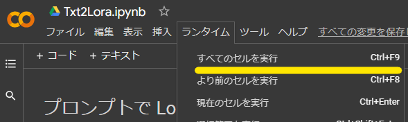
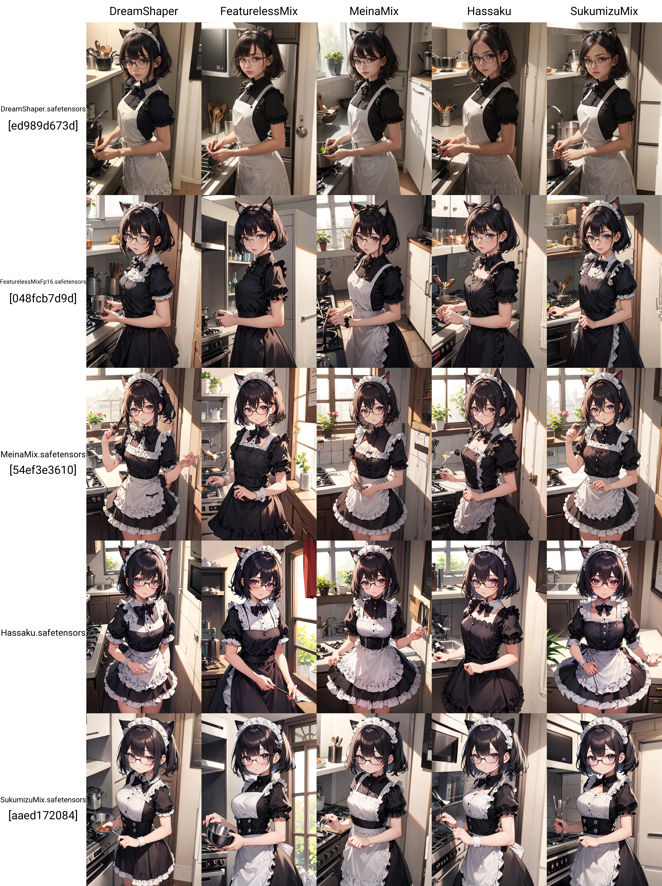
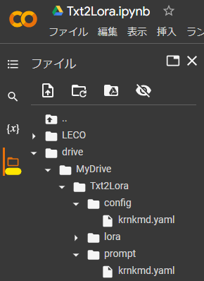
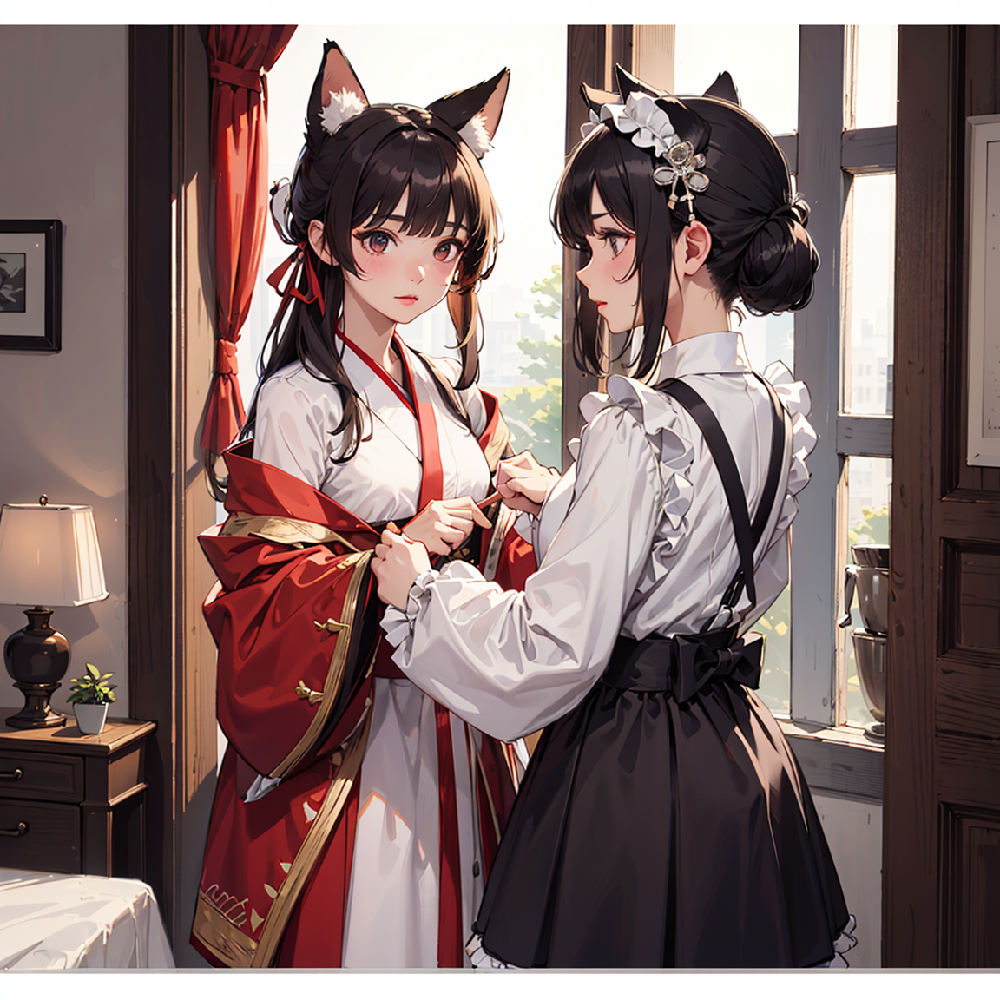
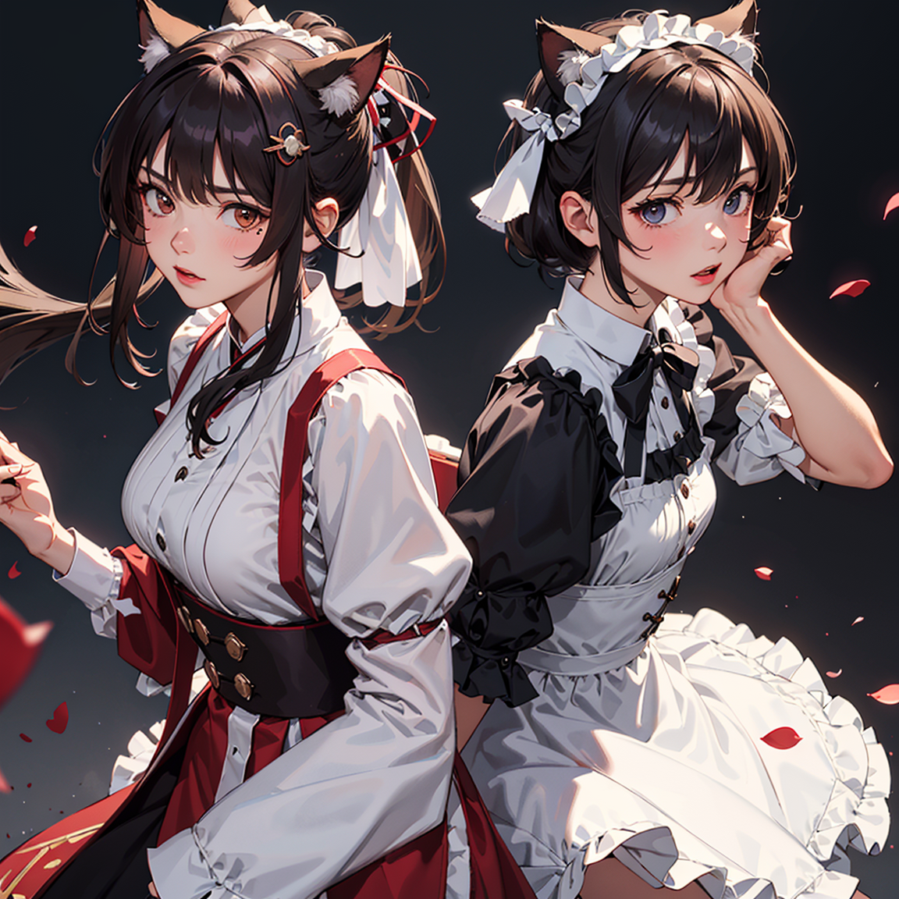
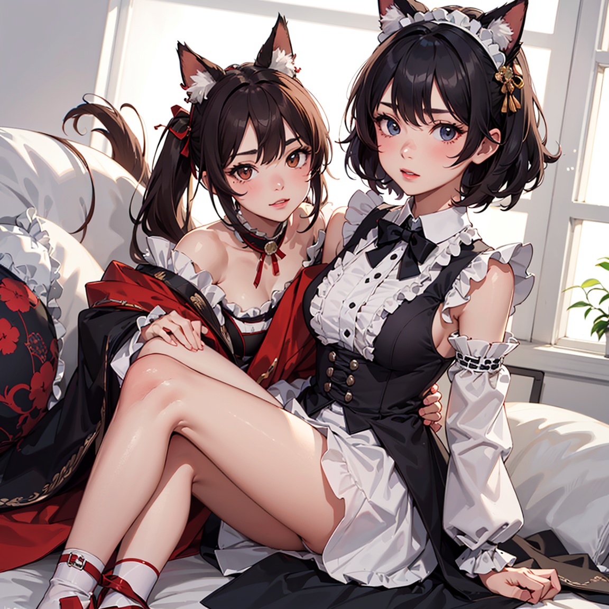
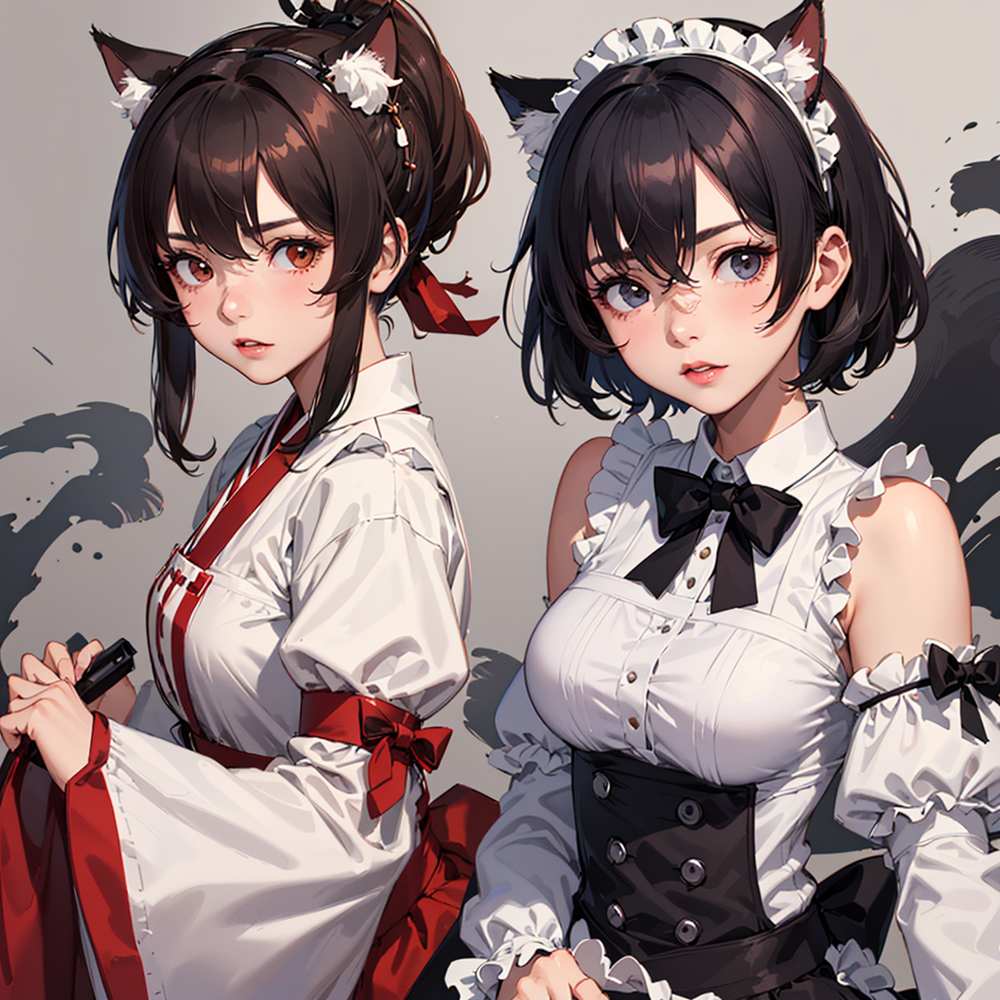

# お手軽！プロンプトでキャラ LoRA 作成

[紹介つぶやき](https://twitter.com/Zuntan03/status/1681680640251682821)

[LECO](https://zenn.dev/aics/articles/lora_for_erasing_concepts_from_diffusion_models) でプロンプトからキャラ LoRA を手軽に作成してみる実験です。  
ローカル PC で画像を生成しながら、絵素材を用意することもなく、[Google Colab のサーバーで気軽に LoRA を学習できます](https://colab.research.google.com/drive/1HYxpHf6neCwK-yudMEexUT9mqjS3cCrD?usp=sharing)。  
学習の設定や学習結果の LoRA は [Google ドライブ](https://drive.google.com/)に保存します。

# キャラ LoRA を作ってみる

まずはキャラ LoRA を実際に作ってみます。

1. で Google Colab のノートブック「[プロンプトで LoRA 作成](https://colab.research.google.com/drive/1HYxpHf6neCwK-yudMEexUT9mqjS3cCrD?usp=sharing)」を開いて、編集せずにメニューの `ランタイム` - `すべてのセルを実行 (Ctrl+F9)` して `このまま実行` します。  

1. Google への接続を要求されますので、Google アカウントを選んで Google Drive に接続します。  
LoRA の学習中は Colab の Web ブラウザを開いたままにしてください。  
ローカル PC は学習に使用しませんので、Stable Diffusion web UI で画像を生成しながら LoRA 学習ができます。
1. 1時間ほど待つと「黒髪ショートの黒縁メガネ猫耳メイド」な LoRA の生成が完了します。  
LoRAは Google ドライブのマイドライブ以下の `/Txt2Lora/lora/krnkmd/krnkmd.safetensors` にあります（KuRoNeKoMaiD）。
1. ダウンロードした `krnkmd.safetensors` を Stable Diffusion web UI の LoRA 読み込みフォルダに  置いて、プロンプトに `krnkmd <lora:krnkmd:1>` とすると、「黒髪ショートの黒縁メガネ猫耳メイドさん」の絵が生成されます。

この手順では `target: "krnkmd"` に `positive: "high ponytail,japanese miko clothes,white kimono,red hakama,brown eyes,cat ears,brown hair,hair between eyes,ear fluff"` を学習した黒猫メイド LoRA が作成されます。  
次の画像はこのLoRAを使い、 `krnkmd<lora:krnkmd:1>, shopping mall` のみのプロンプトで X/Y/Z プロットした画像です。


この画像の `shinto shrine` で巫女服になりかけているように、他のプロンプトに引っ張られて衣装などがあまり再現がされない場合があります。  
打率の低い要素はプロンプトで補助してみてください。  
例）`krnkmd <lora:krnkmd:1>, maid uniform, shopping mall` で、おつかいメイドさんの打率アップ、など

# 自分のキャラ LoRA を作ってみる

次に自分で用意したプロンプトでキャラ LoRA を作ってみます。  
Google Colab のノートブックを、上から順に設定しながら実行します。

## 環境構築

サーバーのランタイムに新しく接続した際に、環境を構築します。  
同じランタイムで 2回め以降の LoRA 学習をする場合は、実行する必要はありません。

## LoRA の設定

LoRA の名前と学習に使用するモデルを設定ファイルに保存します。  
設定ファイルを複数用意すれば、複数の LoRA を一度に学習できます。

1. `lora_name` で LoRA の名前（拡張子を除いたファイル名）を設定します。
1. `model_name` で学習や画像生成に使用するモデルの名前（拡張子を除いたファイル名）を設定します。
	- 学習と画像生成に使用するモデルが異なると、試した範囲では生成する絵の精度が下がるようです。
	↓ 横軸は LoRA 学習用モデル、縦軸は画像生成モデル  
	
	- 非公開の自作モデルの場合は Colab の左端にあるフォルダアイコンの `ファイル` から Google ドライブ(`drive/MyDrive`)経由で `model/` にコピーして、同じファイル名を設定します。
1. `model_url` でダウンロードするモデルの URL を設定します。
	- モデルの名前が一致する `*.safetensors` が `model/` にあれば、ダウンロードしません。
1. `詳細設定` はわかる人以外は無視してください。
1. 左側の実行ボタンで、設定ファイルを `drive/MyDrive/Txt2Lora/config/{LoRA の名前}.yaml` に保存します。
	- 左端フォルダアイコンの `ファイル` で、設定ファイルをダブルクリックすると内容を確認できます。  


## LoRA の学習内容を追加

LoRA の学習内容をプロンプトファイルに保存します。  
プロンプトファイルは設定ファイルと一対一で用意されます。

1. `target` にキャラを呼び出す無意味な言葉（いわゆるトリガーワード）を設定します。  
トリガーワードを用いない場合は、`1girl` などを設定します。
1. `positive` にキャラの特徴を羅列します。`1girl` などは含めません。
1. トリガーワードを使用している場合は、`neutral` に `1girl` などを指定するとｲｲｶﾝｼﾞな気がします。

学習内容を変更しつつ複数回実行することで、ひとつのプロンプトファイルに複数の学習内容を含められます。  
`unconditional`, `action`, `guidance_scale` で他の操作もできますが、コントロールが難しいです。

 学習内容の設定については、[公式の紹介記事](https://zenn.dev/aics/articles/lora_for_erasing_concepts_from_diffusion_models) や [テルルとロビンさんの LECO 紹介動画](https://www.youtube.com/watch?v=NQyBvKlvB5c) なども参考にしてください。

## LoRA の学習

上で設定した LoRA をひとつ学習するだけであれば、何も設定せずに実行すると学習します。

- `learn_lora_names` で複数作成した設定ファイルのどれを学習するかをカンマ(,)区切りで複数設定できます。
- `learn_all` で `drive/MyDrive/Txt2Lora/config/` にあるすべての設定ファイルを学習します。
- `delete_resize_src` でリサイズ前の大きな LoRA を、リサイズ後に自動的に削除します。


黒猫メイドの設定から `target: "tyankmk"` と `positive: "high ponytail,japanese miko clothes,white kimono,red hakama,brown eyes,cat ears,brown hair,hair between eyes,ear fluff"` のみを変更した茶猫巫女 LoRA での画像です。
  
こちらでは `kitchen` が厨房服に化けかけています。

# 顔 LoRA を作ってみる

`positive` に顔の特徴だけ指定し、画像生成のプロンプトで服装を指定することで、きせかえができます。

次の例は `target: "krnkkao"` に `positive: "short hair,black eyes,black rimmed glasses,cat ears,black hair,hair between eyes,ear fluff"` を学習し、プロンプトは `krnkkao <lora:krnkkao:1>` に X/Y/Z plotのプロンプトのみで生成しました。  


同じように `target: "tyankkao"` に `positive: "high ponytail,brown eyes,cat ears,brown hair,hair between eyes,ear fluff"` を学習しての生成です。  


ちゃんと画像を用意して学習した LoRA と比べると、精度や打率は当然下がりますが、とにかく作成が手軽です。  

# 複数キャラ LoRA を作ってみる

黒猫メイドと茶猫巫女の両方をひとつの LoRA に学習させて、Latent Couple や Regional Prompter で出し分けられるかも試してみました。  

|Latent Couple|Latent Couple|Latent Couple|Regional Prompter|
|-|-|-|-|
|||||

Latent Couple プロンプト: `2girls AND (tyankmk:1.6) AND (krnkmd:1.4) <lora:krnkmd_tyankmk:1>`
Regional Prompter プロンプト: `2girls, <lora:krnkmd_tyankmk:1> ADDCOMM (tyankmk:1.8) ADDCOL #(krnkmd:1.4)`

2キャラ同時学習プロンプトファイル:
```
- target: "krnkmd"
  positive: "short hair,maid uniform,frilled skirt,sleeves,maid apron,maid headdress,black eyes,black rimmed glasses,cat ears,black hair,hair between eyes,ear fluff"
  unconditional: ""
  neutral: "1girl"
  action: "enhance"
  guidance_scale: 1
  resolution: 512
  batch_size: 2
  dynamic_resolution: False

- target: "tyankmk"
  positive: "high ponytail,japanese miko clothes,white kimono,red hakama,brown eyes,cat ears,brown hair,hair between eyes,ear fluff"
  unconditional: ""
  neutral: "1girl"
  action: "enhance"
  guidance_scale: 1
  resolution: 512
  batch_size: 2
  dynamic_resolution: False
```

結果としては各 target への学習は確認できたものの、両方とも再現度や打率が低いために実用は難しそうです。  
試した範囲では Latent Couple のほうが打率が高くありましたが、どちらも個別にインペイントしたほうが楽そうでした。  
プロンプトに学習再現用以外の言葉を入れると打率が極端に下がってしまう印象もありました。

`FuturelessMixFp16` モデルのみでの確認ですので、別のモデルやプロンプトで状況が変わるかもしれません。

# まとめ

- ローカル PC の画像生成と並行して、プロンプトを考えるだけで手軽に LoRA あそびができます。
	- 顔 LoRA の使い勝手が良さそうでした。
	- 絵素材不要の学習の手軽さは、品質を犠牲にしつつも新たな選択肢として面白いです。元々効きの悪いプロンプトを補助したりですとか。
	- ﾃｷﾄｰなことを言いますが、一枚絵をプロンプトと併用して reference 系 ControlNet のように絵を寄せられると、夢が広がりそうです。
- ステップ数 (train_iterations) や学習率 (train_lr) は控えめですので、物足りない方は増やしてください。
	- プロンプトによって効きが異なるため、学習を控えめにしつつ効きの悪いプロンプトを画像生成時に補助するのもよさそうに思えました。
